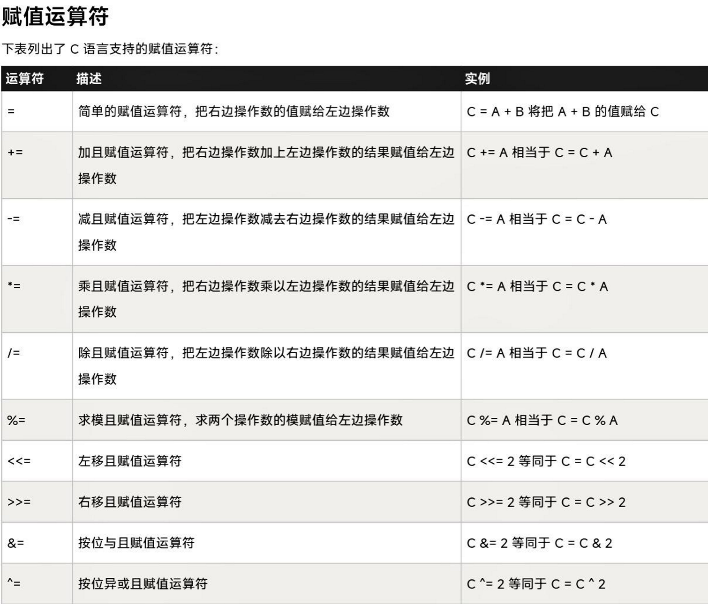
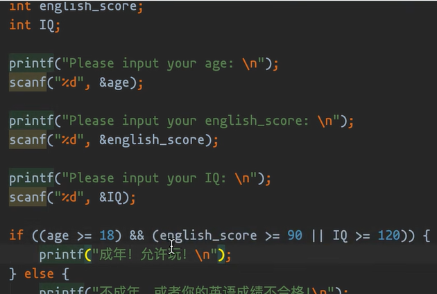
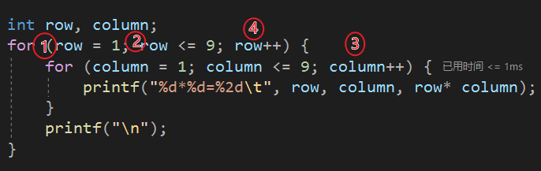
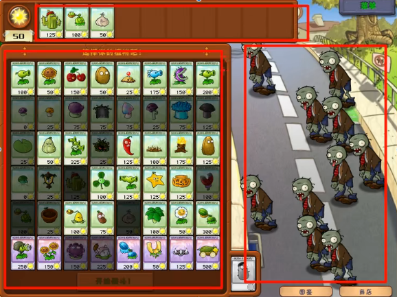

# 注意事项
## 关于VS2022上的C项目
### main
一个软件只能有一个main（因为main是启动点），所以把另一个源文件的命名为main_1，新建项目的话就不会影响了

### 操作
==记得按ctrl+s保存==
==检查大小括号有没有弄混==（**表现为VS2022要求加分号**）

### 文件
debug：工程文件，生成的exe需要依赖vs2022
release：发行版。切换发行版后点生成——生成解决方案，此时release的exe可独立运行，文件也小些
32位的切完x86，先生成解决方案再生成demo_01<示例>

分享代码：压缩demo_01整个文件夹

## 关于C语言
for后先空格再括号

整理对齐代码：按住ctrl，再依次按a,k,f

=是赋值，==才是等于

变量名命名要让人一眼看出其含义，不要int a或者int b，是啥人家都看不明白，不如sum（求和），temp（临时变量），单词组合可以下划线命名法：sun_flower或驼峰命名法：SunFlowerValues

换行一般用\n，\t是4个空格（和前后连在一起也没什么关系）

C语言没有布尔类型，计算机不看回车

---

# 基础内容
快捷一点的变量定义
>int num1 = 1, num2 = 2;

快捷一点的运算
>printf("sum = %d\n", number_1   + number_2);

### printf的使用
>printf("number = %d\n",number);
printf("a = %d, b = %d\n", a, b);

==逗号前面是要输出的内容，后面是要输出的变量==

### scanf_s使用时==记得写&==！（取地址）


## 常量
>int change = AMOUNT - price 比 100 - price更易理解

### 宏定义：给某事物下定义，不用加等号
>#define PI 3.14

### 定义常量
const int SUN_FLOWER = 9999
宏定义和常量命名全大写，用_隔开

---

# 赋值运算符


---

# if的使用
## 基本格式
```c
if ( /*条件*/ ) { //就去执行某个东西
}
```

==如果不带大括号，if的范围只有它这一行和它的下一行==
## 示例


## 关系符的嵌套使用关系到程序的可读性
```c
if((age >= 18) && (english_score >= 90 || IQ >= 120)){printf("成年，允许玩！\n")};
```
## “非”的使用
```c
if(!(age >= 18) || !(english_score >= 90 || IQ >= 120)){printf("成年，允许玩！\n")};
```
---
# else的使用
==else总会找离他最近的if做匹配==

---

# 用户的不合法输入
原因是程序的不严谨
## 示例（会产生负数转换出错的bug，待修正）
```c
#include<stdio.h>
int main(void){

   unsigned age //定义age为无符号整数

   printf("Please input your age:\n");
   int age_input_result = scanf_s("%3u", &age); //代表可以输入3位无符号整型的数
   if (age_input_result != 1) {printf("输入数字不合法！只能输入小于三位的正整数！\n");//!=意思为不等于
   }else {
      printf("age = %u\n, age");
   }

   return 0
}

```
>%3u只会获取前三位数字
return 0后，程序结束，不再执行后面语句

---

# else if：要不然 (级联if-elseif)

```c
#include<stdio.h>
int main(void) {

	int age = 0;
	printf("Please input your age\n");
	int age_inpult_result = scanf_s("%2u", &age);
	if (age_inpult_result != 1) {
		printf("您输入的数字不合法！请重新输入\n");
		return 0;
	}
   //如果age=18就执行“满足成年”，否则依次执行
	if (age == 18) {
		printf("恭喜您已成年！\n");
	}
	else if (age >= 70) {
		printf("您是老年人\n");
	}
	else if (age >= 50) {
		printf("您是中年人\n");
	}
	else if (age > 18) {
		printf("您是青年人\n");
	}
	else if (age > 0 && age < 18) {
		printf("您还没成年\n");
	}
	//如果还是不行，那就else收尾
   else{
		printf("您输入的数字不合法！请重新输入\n");
	}

	return 0;
}
```
---
# switch语句

==只能int==

当对同一个变量进行判断操作，选择某些条件的时候，此时switch可能是最佳选择（一个变量满足多种判断）
写法：每写一个case后面都要跟一个break

> ==增补：到7或9就执行什么：==
>
> ==case 7:case 9:==

## 示例
```c
#include<stdio.h>
int main(void) {
	unsigned floor = 1;

	printf("Please inpult your munber:(type integer):\n");
	scanf_s("%3u", &floor);//保证楼层合法且不为负数

	//switch就像一个电梯，age是载客，输入谁找谁
	switch (floor) {
		case 4:
			printf("You are on the fourth floor!\n");
			break;//break：到了，出去了。没有break就相当于按了电梯，但是到了该到的楼层不出去，那就会接着往下执行

		case 5:
			printf("You are on the fifth floor!\n");
			break;

		case 6:
			printf("You are on the sixth floor!\n");
			break;

		default://只有6层，去其他楼层滚！(作为一个提醒，它对用户是必要的）
			printf("Fuck off!");
			break;

	}
	
	return 0;
}
```
---
# 三元运算符
```c
#include<stdio.h>
int main(void) {
	int num;
	printf("Please input a number\n");
	scanf_s("%d", &num);
   //对就执行没毛病，错就执行有毛病
	(num == 10) ? printf("没毛病！") : printf("有毛病\n");
	return 0;
}

```

---
# while循环
当while里面为真时才会执行循环
## 示例
```c
#include <stdio.h>
#define ONE_KILOMETER 1000

int main(void){
	int run_meter = 0;
	while (run_meter < ONE_KILOMETER) {
		printf("已经跑了%d米\n",run_meter);
		run_meter += 1;
	}
	printf("1000米跑完了！\n");

	return 0;
}
```
%d用于显示一个值（后面的run_meter)
==当（）内内容成立，则执行{}内内容==
每次跑1米，跑完去找体育老师判断跑了1000米没有，没有就接着去跑（由于跑完1000不循环了，所以建议printf告诉用户跑完了）

## 循环条件
1. 判断条件是否满足条件（证明跑了1000米）
2. 一定要有自增衡量变量，可能会有界限，突破界限时退出循环（向前迈出步子）
3. 可能会存在初始化的量（这个量从哪开始，这个人从哪开始跑） 

## 死循环
必要的：银行运作、高并发
   >简单来说，四核CPU 一核微信 一核QQ，俩都是==像==while死循环跑着，所以要理解==何时利用死循环==

---

# continue：跳过

```c
#include <stdio.h>
#define GOLD 1000

int main(void) {
	int rush = 0;
	while (rush <= GOLD) {

		if (rush == 500) {
			printf("挖到铁矿，扔掉不要！\n");
			rush++;//碰到不挖了，跳下一个
			/*满足一定要求的时候，如果使用continue语句，就代表
			我不要满足条件中的内容，但是我还是要继续干（还是要
			继续执行循环，但是要注意，一定要在continue之前rush++）*/
			continue;
		}

		printf("已经跑了%d米\n", rush);
		rush += 1;
	}
	printf("1000米跑完了！\n");

	return 0;
}

```
==注意不要遗漏自增变量==，挖到了不加的话rush就一直在500循环，+1继续就可以跳出if循环

---

# break：中断
只能断离他最近的那一层while循环

---

# continue和break总结
==continue和break只能在循环中使用==
break还可以在switch语句中使用

---

# do...while语句（工作很少用）
==先干活（循环），再判断==，若为true，继续do-while循环
与while的区别:
>while(){}
>do{}while;

==有分号！==

### 简单举个例
```c
#include <stdio.h>
#define GOLD 1000

int main(void) {
	int rush = 1;
	do
	{
		rush++;
		printf("rush = %d\n", rush);

	}while(rush <= 1000);//记得这里加分号！
	
	return 0;
}
```

---

# for循环(比while灵活些)
先来过一遍循环三要素（非必选，若没有可能会出问题，除非是业务要求）
1. 初始化的变量
2. 判断条件（满足或不满足）
3. 自增衡量变量
==输入for在按两下tab可调出带条件的for循环==
```c
#include <stdio.h>
#define GOLD 1000

int main(void) {
	int rush;
	//C primer Plus 定义变量不赋值叫“声明”
	for (rush = 1; rush <= GOLD; rush++)
	{
		printf("rush = %d\n", rush);
	}
	printf("挖完了！\n");

	return 0;
}
```
for循环，**第一个分号前面的东西只会执行一次**，通常拿来初始化值
>rush = 1

**第二个分号前面内容执行完后，会先执行大括号内内容，再到第三个分号前面内容**

上述流程执行完后，会执行第一个分号到第二个分号内容，即：判断-执行-增加
判断失败，==直接跳出for循环==

---

# 调试：监听变量每一步是怎么执行的
## 关于使用
调试前先打断点，程序会执行到断点前面，剩下的靠你操作

在第8行前打点，调试开始后按下F11（逐语句执行）开始执行第8行，箭头指向下一行

鼠标可以停在变量上看看它现在值是多少

printf输出每步结果，没有调试工具时要善于利用printf查看每步执行结果
说白了，**输出也是一个不错的“调试工具”**

## 示例
```javascript {.line-numbers}
#include <stdio.h>

int main(void) {
	int index;
	int sum = 0;

	for (index = 0; index < 10; index++) {
		sum += index;
		printf("index = %d, sum = %d\n", index, sum);
	};
	return 0;
	}
```

## 关于效率
==调试完把输出窗口关闭！==

==bug修复完把断点去掉！==**不然会影响运行效率**

==诊断工具没事儿就关掉，耗内存！==，所以没事儿也别点那个已用时间多少ms的灰色字体

---

# for嵌套
*for、while、do...while都是可以嵌套使用的*

## 演示

在6~11行加断点调试，f11发现第一层for循环进行完之后，会先把第二层for循环进行完，再继续第一层下一次的for循环

再复习一遍执行顺序（按照序号顺序执行）


```javascript {.line-numbers}
#include<stdio.h>

int main(void)
{
	int row, column;
	for (row = 1; row <= 9; row++) {
		for (column = 1; column <= 9; column++) {
			printf("%d * %d=%2d\t", row, column, row * column);/*使输出的int型的数值以2位的固定位宽输出。
			如果不足2位，则在前面补空格；如果超过2位，则按实际位数输出，这里要注意一下*/
		}
		printf("\n");//一行column执行完后换下一行
	}

	return 0;
}
```

---

# 函数：一个复合的，能重复使用的工具
**函数讲究通用性**

## 示例一
```javascript {.line-numbers}
#include<stdio.h>

//main主函数，整个程序的入口点 

//要写一个函数，首先要预定义（预声明）
//声明函数
void sum(int number_1, int number_2);

//函数名：sum
//函数的返回值类型：void
//函数的参数：有两个参数，参数的类型都是int类型
//参数名

int main(void)
{
	sum(96,97);
	return 0;
}

//定义函数
//大括号内的叫函数体
void sum(int number_1, int number_2) {
	printf("Please input your two numbers,(type int,space):\n");
	scanf_s("%d %d", &number_1, &number_2);//这里要注意""的位置和&的添加
	printf("sum=%d\n", number_1 + number_2);
}

```

## 示例二
```javascript {.line-numbers}
//建议通过调试复习执行步骤
#include<stdio.h>
//声明函数
//形参——形式参数
//只有定义或者声明函数的时候，那里的参数才叫实参
int sum(int num1, int num2);
//函数名：sum
//函数的返回值类型：int
//函数的参数：有两个参数，参数的类型都是int类型
//参数名

int main(void) {
	//使用函数---调用函数
	//实参——实际参数（具体的值，输入的值）
	//调用方这边的参数，一定是实参
	int num1, num2;
	printf("输入两个数，中间空格隔开以计算和\n");
	scanf_s("%d %d", &num1, &num2);
	int result = sum(num1, num2);
	printf("result=%d\n", result);
	return 0;
}
//定义函数
//大括号内叫函数体
int sum(int num1, int num2) {
	int score_sum = num1 + num2;
	return score_sum;
}


```

void：什么都不返回
如果是void main()，那就不用写return 0
函数开始时怎么声明的，后面就怎么定义
函数类型一一对应
再强调一遍：==scanf_s后面记得加地址！==

---

# 函数作用域
辅助理解：域，一个国，上面示例二12行main是一个国，25行sum是另一个国。
一个函数（国家）不能调用另一个函数（国家）的作用域（户口本），因为这个户口本（作用域）没有登记这个人口（如sun_flower）
**也就是说在哪个大括号中定义的变量，只能在这个大括号中访问**

**若想几个函数共用一个变量，请把它定义在函数外面**，此时它不属于任何国家，它属于地球 
## 示例
```javascript {.line-numbers}
#include<stdio.h>

int sum(int num1,int num2);

int sun_flower = 100;

int main(void) {
	printf("main_sun_flower = %d\n", sun_flower);
	sum(1, 1);//这里没有输出score_sum，这里的sum（1，1）是为了调用函数得到里面的printf结果并非为了求和
	return 0;
}

int sum(int num1, int num2) {
	int score_sum = num1 + num2;
	printf("sum_sun_flower = %d\n", sun_flower);
	return score_sum;
}
```
>注意：全局变量会受到函数污染
两个函数中，各自的同名变量是独立的（美国的Frank和中国的Frank当然不是同一个人）

---

# 数组
## 概念

这有三个数组
数组的好处是：可以一次定义多个变量，然后给这些变量赋值

## 使用示例
前面不初始化，单靠后面赋值，那除了赋值的数，其他数都是垃圾
```javascript {.line-numbers}
#include<stdio.h>
int main(void) {
	//第一个下标[这个叫下标]（第一个号）
	//规定下标从0开始，0代表第一个元素，以此类推
	//数组类型 数组名称[数组长度] = {初始化值}
	unsigned plants[5] = { 100,50,150,50,25 };//定义及初始化
	printf("plant---%u\n",plants[1]);//使用
	return 0;
}
```
==定义的时候不要加和减，该是什么就是什么==

数组名[下标(索引)] = 值
>plants[3] = 99 的意思是给数组第四个元素赋值为99

**分清下标和数组长度在中括号内含义**，==也就是定义和使用时中括号各自含义==
==下标从零起==

## 二维数组
```c
//平时不常用，算法题可能多见
#include<stdio.h>
int main(void) {
	int a, b;
	int score[6][5] = { {1,3},{31,26,2,26,67},{1,3,5,6},{3,3,6},{1,9},{5} };
	//第一个大括号内是行数，第二个大括号内是列数，没有就是没有数
	scanf_s("%d %d", &a, &b);
	printf("score = %d\n", score[a][b]);
	return 0;
}
```

---

# 数组-表驱动法-（布尔类型）
优点：让逻辑更简单
==代替if-else的好选择==,从头到尾就是函数的调用
>array意思是数组

## 示例一：有布尔
```javascript {.line-numbers}
#include<stdio.h>
#include<stdbool.h>

int 年份对应的月数天数(int 月,int 年);
bool 是闰年(int 年);
int 月,年;

//表驱动法：免去繁多的if、else，用数组和存储数据库的方式去替代
int main(void) {
	printf("输入月份和年份，中间用空格隔开\n");
	scanf_s("%d %d", &月, &年);
	printf("总共%d天\n", 年份对应的月数天数(月, 年));
	return 0;
}

//返回每个月的天数，依赖于文件中的 是闰年() 函数
int 年份对应的月数天数(int 月, int 年) {
	int day_array[12] = { 31,是闰年(年) ? 29 : 28,31,30,31,30,31,31,30,31,30,31 };
	return day_array[月 - 1];
}

//计算该年份是不是闰年或者平年，若是闰年就返回true
bool 是闰年(int 年){
	if (年 % 400 == 0 || (年 % 4 == 0 && 年 % 100 != 0))
		return true;
	else
		return false;
}
```

## 示例二；免布尔直接莽
```javascript {.line-numbers}
#include<stdio.h>
//#include<stdbool.h>

int 年份对应的月数天数(int 月,int 年);
//bool 是闰年(int 年);
int 月,年;

int main(void) {
	printf("输入月份和年份，中间用空格隔开\n");
	scanf_s("%d %d", &月, &年);
	printf("总共%d天\n", 年份对应的月数天数(月, 年));
	return 0;
}

int 年份对应的月数天数(int 月, int 年) {
	int day_array[12] = { 31,(年 % 400 == 0 || (年 % 4 == 0 && 年 % 100 != 0)) ? 29 : 28,31,30,31,30,31,31,30,31,30,31 };
	return day_array[月 - 1];
}

/*bool 是闰年(int 年) {
	if (年 % 400 == 0 || (年 % 4 == 0 && 年 % 100 != 0))
		return true;
	else
		return false;
}*/
```

# 枚举（也很常用）
较灵活
```c
#include<stdio.h>

int main(void) {
	enum WEEK
	{
		MON = 1, TUE, WED, THU, FRI, SAT, SUN
	};
	//第一个给了1，后面就会+1递增

	//使用枚举
	enum WEEK day = FRI;
	printf("%d", day);
	return 0;
}

```

---

# 指针
[菜鸟传送门](https://www.runoob.com/cprogramming/c-pointers.html)
## 比喻理解
### 比喻一 
快捷方式通过路径找到原程序
空指针：“此快捷方式所指向的程序已删除”
一旦快捷方式产生，立刻指向源文件，即使他改变位置
也就是说，==指针指向的内容，内容可以做出改变，但是指针永远不会变==

### 比喻二
医生点病人，2号走了，医生指2号就是指空区域，不知道该到谁
如果世上病人没了，医生还有何用？这就是空指针
医生要看frank，frank在一号位，他换到了二号位，医生点的frank还是frank，位置只是快捷方式
医生（快捷方式）可以变，可以没有医生，但病人不会变

## 空指针和野指针
空指针：指向一块空的（没有意义的）区域
野指针；医生疯了，看见个人就给他看病

所以初始化时，指针一定要给null，不然它会成野指针瞎指

5号走了，医生还喊5号，也是瞎看：野指针

## 代码
指针是一个变量，存另一个变量的地址
### 示例；通过指针拿到数据
```c
#include<stdio.h>

int main(void) {

	int sun_flower = 100;
	//地址符&

	int* p = &sun_flower;//为sun_flower创建一个快捷方式
	//变量名是p，类型是int*类型（整形指针类型）
	//p变量保存了sun_flower的地址
	//假如p是快捷方式，那他保存了sun_flower地址

	printf("sun_flower address = %p\n", &sun_flower);//输出p的地址

	printf("p = %p\n", p);/*输出快捷方式p（保存）的值
						  （p已经是地址了，不用再取了，再取就是快捷方式的地址了）*/
	//所以说，这俩是一样的
	//sun_flower真实类型是int类型，所以这里用%d输出

	printf("拿到sun_flower的真实数据:%d", sun_flower);

	printf("通过指针（快捷方式）拿到sun_flower的值:%d\n", *p);

	return 0;
}
```

### 示例：空指针
```c
#include<stdio.h>

int main(void) {

	int* ptr = NULL;//空指针：谁都不指，指NULL告诉程序要学会说没病人
	printf("ptr = %p\n", ptr);

	int* p;//野指针，说自己不是医生（直接error）
	//程序此时会随机分配，防止空指针的产生异常（但vs会直接报错）
	//没有意义的指向

	//我们定义指针，通常就直接直接把他所指向的值也给了
	return 0;
}

```

## 指针保存数据地址
### 符号理解
==*  &总要有一个，如果都没有，就会产生像第四行一样的结果
p就是快捷方式，* p就是双击，也就是说写了 * 就代表你要用这个快捷方式了（100）
&表示从数值读取地址，* 表示从地址读取数据（*就是去地址符）
带星号就是数，不带就是地址呗==

（**在cpp中， &叫引用， *叫做解引用**）

int i，scanf_s传数字时不加&，scanf_s会把你输入的值存到一个地址为6的地方去了，而不是i那里

```javascript {.line-numbers}
int number = 100;
int *p = number;
printf("number的地址:%p\n",&number);//显示地址
printf("number的地址:%p\n",p);//100直接转16进制显示64
```
所以说在保存一个数组地址的时候，&可以不用

### 示例
```c
#include <stdio.h>

const int MAX = 3;

int main()
{
    //数组名的值是个指针常量，也就是数组第一个元素的地址，不用&(找到班长就能找到所有人)
    int  var[] = { 10, 100, 200 };
    int* ptr = var;
    printf("var的地址: %p\n", &var);
    printf("var的地址: %p\n", var);
    printf("var[0]的地址: %p\n", &var[0]);
    printf("ptr = %p\n", ptr);

    int number = 100;
    //亲测：不管怎么样，是int 型的都要&才能获得变量的地址
    int* p = &number;//但如果p = number（p指向number是不对的）
    printf("number的地址: %p\n", &number);
    printf("number的地址: %p\n", number);
    //变量输出必要带&

    /* 指针中的数组地址(运算？) */
    ptr = var;
    for (int i = 0; i < MAX; i++)
    {

        printf("存储地址：var[%d] = %p\n", i, ptr);
        printf("存储值：var[%d] = %d\n", i, *ptr);

        /* 指向下一个位置 */
        ptr++;
    }
    return 0;
}
```

## 指针数组和字符串
指针数组：可以存储多个地址
字符串都以\0结尾
>因为c语言在给数组分配空间时，在最后一个元素后面还会再预留一个地址空间
### Frank示例
```c
#include <stdio.h>

const int MAX = 3;

int main()
{
    //指针数组
    int* p_arry[3] = { NULL,NULL,NULL };
    //可以存储多个地址

    //for循环版
    char greeting[6] = { 'H','e','l','l','o','\0' };
    for (int i = 0; i < 6; i++)
    {
        printf("%c", greeting[i]);//%c是字符型格式符
    }

    //指针混合字符串法
    const char* p = "Hello";//vs2022提示需要const char* 而非char*
    printf("p=%s", p);//%s用于输出字符串（字符串型格式符）

    return 0;
}
```
### C指针数组
[来自菜鸟教程](https://www.runoob.com/cprogramming/c-array-of-pointers.html)
```c
#include <stdio.h>
 
const int MAX = 4;
 
int main ()
{
   const char *names[] = {
                   "Zara Ali",
                   "Hina Ali",
                   "Nuha Ali",
                   "Sara Ali",
   };
   int i = 0;
 
   for ( i = 0; i < MAX; i++)
   {
      printf("Value of names[%d] = %s\n", i, names[i] );
   }
   return 0;
}
```

## 多级指针：写游戏外挂肯定会用到
### 示例
```c
#include <stdio.h>

const int MAX = 3;

int main()
{
    //多级指针：套娃(快捷方式的快捷方式)
    int number = 100;
    int* p_one = &number;
    int** p_two = &p_one;//有两个*，注意！

    //拿到100的方式
    printf("%d\n", **p_two);
    return 0;
}
```

## 函数参数使用指针
==在这个例子里这确实不是最简单的方式，但是他教你的也不是如何写最简单的代码，他只是告诉你这个指针怎么用==
==看标题他是在举例子教我们函数参数使用指针别再纠结方不方便了==
[传送门](https://www.runoob.com/cprogramming/c-passing-pointers-to-functions.html)
### 引例（错误的）
```javascript {.line-numbers}
#include <stdio.h>

void exchange(int num_a, int num_b);

int main()
{
    int a = 2, b = 5;
    exchange(2, 5);

    printf("a=%d,b=%d\n", a, b);
    return 0;
}

void exchange(int num_a, int num_b) {
    int temp;
    temp = num_a;
    num_a = num_b;
    num_b = temp;
    //是两个国家的人，传不过去
}
```

### 正确做法（交换地址？）
```javascript {.line-numbers}
//指针在函数中作为参数在传递，就相当于一个护照
/*弹幕：我觉得是因为只换数的话，他在函数中只是计算，
和这个变量没关系，变量起的只是一个将数带进去的作用，
所以在main中没交换；而指针是指的一个内存位置，
而不是一个数，换句话说在函数中此时做的不是数的交换*/
#include <stdio.h>

void exchange(int* num_a, int* num_b);

int main()
{
    int a = 2, b = 5;
    exchange(&a, &b);
    
    printf("a=%d,b=%d\n", a, b);
    return 0;
}

void exchange(int* num_a, int* num_b) {
    int temp;
    temp = *num_a;
    *num_a = *num_b;
    *num_b = temp;
}
```

## 指针作为函数返回值（好例子）
```c
//字符串操作多用指针
#include <stdio.h>
#include <string.h>

//声明函数：返回长度最长的字符串
char* strlong(char* str1, char* str2) {
    if (strlen(str1) >= strlen(str2)) {
        return str1;
    }
    else {
        return str2;
    }
}

int main() {
    char str1[30], str2[30], * str;//定义了两个字符串
    gets(str1);//直接从键盘上获取
    gets(str2);
    str = strlong(str1, str2);
    printf("Longer string: %s\n", str);

    return 0;
}
```

---

# Frank教程忽略的一些内容
1. 递归，老师肯定会讲，没什么好讲的，记得斐波那契数列就行
2. 字符串老师会讲
3. 结构体（在面向对象时叫做类）就是一个类别，老师也会讲，菜鸟那讲得不好，去看那本书
4. 共用体老师不讲
5. 位域：对C语言有兴趣可以去看看
6. typedef学结构体时会讲
7. 文件读写：记住读写就行，看书，==记住固定格式==
8. 强制类型转换
9. 错误处理，在读写文件时可以引用这个模块，但要记得加头文件
10. 内存管理：==若是把C语言作为入门的编程语言，那动态内存的分配可以了解一下（菜鸟有，书上应该挺详细），考试可能会遇到==
11. 命令行参数，有兴趣可以研究
12. ==不要浮躁==

# 一些散话
## 可变参数
想传多个参数（不知道有几个）
固定格式
## 命令行参数
让其可以在cmd里用
## 预处理器：有兴趣就看
看一下
一般和C的头文件配合去使用（也可以自己创建头文件）
## 库函数
sqrt(9)，默认括号内为double类型，返回double类型数据，所以用double类型接收

# 完结撒花，Frank想说的话
精英总是少数的，精英学完C之后不会沉溺于此，而会去找到适合自己的方向
现在是BS的时代，如果要走BS开发的话，一定要知道接下来选择的方向。
有些人学完C就去学C++，殊不知C++的岗位少之又少，对人能力要求高，所以不要去无脑学习。
知识是无限的，但==人总要精通某一方向的领域==
所以，一定要知道接下来要选择什么岗位，学什么东西
==人只有4年，决定好自己的方向==
==趁年轻，多学习，多努力，以后你至少还有选择的权利！==