# 数据类型
* 整数
 * int
 * printf("%d",...)
 * scanf_s("%d",...)
* 带小数点的数
 * double
 * printf("%f",...)
 * scanf_s("%lf",...)

# 表达式
计算时间差
```c
int hour1, minute1;
int hour2,minute2;

scanf("%d %d", &hour1, &minute1);
scanf("%d %d", &hour2, &minute2);

int t1 = hour1 * 60 + minute1;
int t2 = hour1 * 60 + minute2;

int t = t2 - t1;

printf("时间差是%d小时%d分。", t/60, t%60);
```

# 求平均值
```c
int a,b;

scasnf("%d %d"，&a, &b);

double c = (a+b)/2.0;

printf("%d和%d的平均值=%f\n",a ,b ,c);
```

# 优先级
连续运算：从左到右
算术运算 > 关系运算符 > 赋值运算 > ==和!=
> 对6>5>4，6>5正确，返回1，1>4错误，返回0
> a == b == 6也是如此

# 嵌套if-else练习
```c
#include<stdio.h>

int main(void)
{
	int a, b, c;
	scanf_s("%d %d %d", &a, &b, &c);

	int max = 0;

	if (a > b)
	{
		if (a > c)
		{max = a;}
		else { max = c; }
	}
	else {
		if (b > c) {max = b;}
		else { max = c; }
	}
	printf("max = %d", max);//单一出口：最后printf一次那就好了
	return 0;
}
```

# if和else if的区别

你写的不是关系，不是说明，而是步骤

```c
#include<stdio.h>

int main(void)
{
	int age;
	printf("please input your age\n");
	scanf_s("%d", &age);
	if (age > 999) { printf("是四位数\n"); }
	else if (age > 99) { printf("是三位数\n"); }
	else if (age > 9) { printf("是两位数\n"); }
	return 0;
}
```

上面的else if若换成if，则程序会一直判断下去，而else if如果符合，直接跳出判断

# while小练习

```c
#include<stdio.h>

int main(void)
{
	int 数字;
	int 位数 = 0;
	printf("请输入数字\n");
	scanf_s("%d", &数字);
	if (数字 < 0) { 数字 = -数字; }
	while (数字 > 0)
	{
		位数++;
		数字 = 数字 / 10;
	}
	printf("这是%d位数\n", 位数);
	return 0;
}
```

# 计算前保留原始数据

```c
int x;
int ret = 0;

scanf_s("%d", &x);
int t = x;//t用于储存x初始值
while (x>1) {x /= 2; ret++;}
printf("log2 of %d is %d", t, ret);
return 0;
```

# 数字炸弹
[随机数进阶教程](https://cubox.pro/my/card?id=ff808081828c15960182916422985e03)

**初代：存在bug，留作纪念**
```c
#include <stdlib.h>
#include <stdio.h>
#include <time.h>

//随机数 
int main()
{
	srand((unsigned)time(NULL));//用于改变rand

	int 随机值;
	int 首数;
	int 尾数;
	int 输入值 = 0;//用户输入的数

	//初始化：检验首尾合法
	do
	{
		printf("请输入首数\n");
		scanf_s("%d", &首数);
		printf("请输入末数\n");
		scanf_s("%d", &尾数);
		(首数 < 尾数) ? printf("数字在%d到%d间\n", 首数, 尾数) : printf("输入不合法，请重新输入\n");
	} while (首数 > 尾数);
	随机值 = (rand() % (尾数 - 首数 + 1) + 首数);

	//输入与识别(防止初始化输入错误)
	printf("请输入区间内的一个数\n");
	scanf_s("%d", &输入值);
	while ((输入值 != 随机值) || (尾数 - 首数 == 2))//如果不等于
	{
		while ((输入值 < 首数) || (输入值 > 尾数))//输入数字不超区间(防止过程输入错误)
		{
			printf("输入不合法，请重新输入\n");
			scanf_s("%d", &输入值);
		}

		if (输入值 < 随机值)//移头
		{
			首数 = 输入值;
			printf("数字在%d到%d间", 输入值, 尾数);
		}

		else//移尾
		{
			尾数 = 输入值;
			printf("数字在%d到%d间", 首数, 输入值);
		}

		//下一次运算
		printf("请输入区间内的一个数\n");
		scanf_s("%d", &输入值);
	}

	printf("恭喜你中了！随机数就是%d\n", 随机值);
	return 0;
}
```
终版：还是拦不了除数字以外的数

```c
#include<stdio.h>
#include<stdlib.h>
#include<time.h>

int main()
{
	srand((unsigned)time(NULL));
	int first;
	int last;
	int input;
	int random;
//检验首尾数合法性
	do {
		printf("Please input the first number:\n");
		scanf_s("%d", &first);
		printf("Please input the last number:\n");
		scanf_s("%d", &last);
	} while ((last - first) < 3);
//生成范围内随机数
	random = (rand() % ((last - 1) - (first)+1) + first);
//执行循环，直到猜中数
	do {
		printf("please input a numbei between %d and %d\n", first, last);
		scanf_s("%d", &input);
		if ((input < first) || (input > last)) {
			continue;//如果输入不合法，直接抛弃这次的输入内容,进行下一轮输入
		}
		(input < random) ? (first = input) : (last = input);//三元运算符要加括号
	} while (((last - first) > 2) && (input != random));

	printf("没错，那个数就是%d\n", random);

	return 0;
}
```


# 随机数
每次召唤rand()就得到一个随机的整数
## 取余
x % n 的结果是[0,n-1]的一个整数

# 练习：算平均数


# 循环的选择
若有固定的次数，用for（起点终点明确）
若必须执行一次，do-while
其他情况用while

# break在循环中(有点意思)：判断素数
对于下式
```javascript {.line-numbers}
#include <stdlib.h>

int main()
{
	int x;
	int i;
	scanf("%d", &x);
	int temp = 1;//用于暂存结果
	for (i = 2; i < x; i++) {
		if (x % i == 0) {
			temp = 0;
			break;//在break内，碰到break就跳出循环
			//不加break会导致后面的结果覆盖temp当前值：0
		}
	}
	if (temp = 1) { printf("是素数\n"); }//若从始至终temp都不终止输出0（保持为1），则为素数
	else { printf("不是素数"); }
	system("PAUSE");
	return 0;
}
```
碰到break就跳出循环
continue是这一轮没做的东西不做了，继续下一轮

# for循环条件的使用：计算前50个素数

在这个基础上，


# 当内层break，整个程序break
## 法一：传统教科书

## 法二：在goto后写一个标号（下面以out为标号举例）
out相当于一个传送门，goto是开关


# 求和（for的运用）

## 变式


# 整数分解
## 加空格
让字符和空格分别输出，以x当前值是否为个位数（int环境下除10是否等于0）来判断

## 逆序：依次夺取最高位输出
```c
#include <stdio.h>

int main()
{
	int 输入;
	printf("请输入一个数用于倒序\n");
	scanf_s("%d", &输入);
	while (输入 > 0)
	{
		printf("%d", 输入 % 10);
		输入 /= 10;
		if (输入 != 0){printf(" ");}
	}

	return 0;
}
```

# 求最大公约数：辗转相除法（枚举效率低）

# 数据类型
unsigned表示这个数字不以补码的形式来表现（不把第一位看作补码）
unsigned的初衷是为了做纯二进制运算，主要是为了移位（想让最高位的一不起作用）
以翁恺老师画的图来举例

unsigned char a = 0
a = a - 1
那么最终a输出为255
若a开始为255，那么经过a = a + 1，a最终为0，因为char只有8个比特，进位的第九个比特被挤出去了

# 整数的输入输出
## 形式
* 只有两种形式：int或long long
  * %d：int
  * %u：unsigned
  * %ld：long long
  * %lu：unsigned long long
  当我们把所有小于int的变量传给printf的时候。编译器会把这些变量转换为int传进去。

## 进制
**以%d（十进制）输入的时候，**
以0开始的数字字面量是八进制
以0x开头的数字字面量是16进制
但是==%d==的printf只会输出10进制

## ==选择整数类型==
* 为了准确表达内存做底层程序的需要，所以要分这么多种整数
* ==如果没有特殊需要，就选择int==，原因是现在的CPU字长普遍是32位或64位，一次内存读写就是一个int一次计算，也是一个int，选择更短的类型不会更快，甚至可能更慢。
* 现代的编译器一般会设计内存对齐，所以更短的类型实际在内存中有可能也占据一个int的大小。（虽然sizeof告诉你更小）
* Unsigned与否只是输出的不同，内部计算是一样的。

## double和float
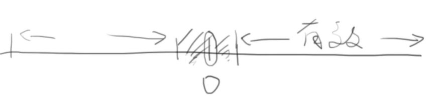
中间有一小段是无法表达的

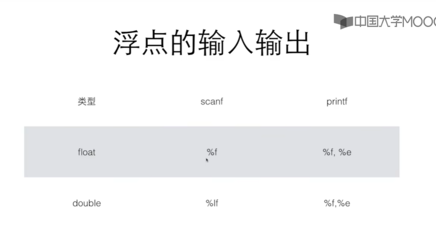


# 浮点数
## 表达
nan：不是一个有效数字
%e:输出科学计数法
%.16f：小数点后输出16位小数（会四舍五入）
## 范围和精度
计算机浮点数中，两个数之间是存在最小距离的，当真实输出的数离谁近，实际输出数就是谁
printf输出inf表示超过范围的浮点数（－inf是－∞）
printf输出nan表示不存在的的浮点数
无穷大不能用整数来表达，但可以用浮点数来表达
带小数点的字面量是double，float需要用F或f后缀来表明身份f1==f2可能失败
fabs(f-f2)<1e - 8//看看绝对值是不是小于很小的数
不要用浮点数做精确运算，不然会累计误差，用小单位运算，如算钱用“分”
## ==总结==
==没有特殊需要，只用double
scanf只能读int不能读char
％d后没有空格，那就是读到连续的整数为止，后面的给下一个读（==有空格的情况没学会==）
==字符理解欠佳==
# 逃逸字符
\b：回退一格，让下一个字符在这里输出（可以覆盖原内容）
\t等于按一下Tab，Tab是在一行中固定位置而不是固定的字符数量，这个叫做到下一个制表位
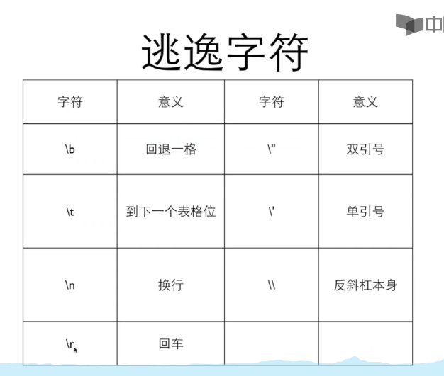
>回车是回到行初
换行是切换到下一行(源于打字机)

现在的回车自动换行
# 自动类型转换
* 对于printf，任何小于int会被转换为int；float会被转换成double
* 但是scanf不会要输入short，需要％hd

# 强制类型转换
通常为大转小，=格式为：(类型)值==
>(int)10.2

转换方式参考前面翁恺老师画的时钟图（加减分钟）
强制类型转换的优先级高于四则运算，所以运算记得加括号
>int i = (int)(a / b)
==布尔类型尚不掌握==

# 逻辑运算
判断一个字符是否是大写字母：
>c>='A' && c <= 'Z'

index不在0~99范围内：
>index < 0 || index > 99

age大于等于20：
>!age < 20

## 短路
以a==6 && b==1为例，若前式不成立，则判断结束
所以==不要把任何赋值组合到表达式内（包括a＋＋）==

# 函数
**为了避免后续维护复杂，请尽量使用函数**
## 调用函数
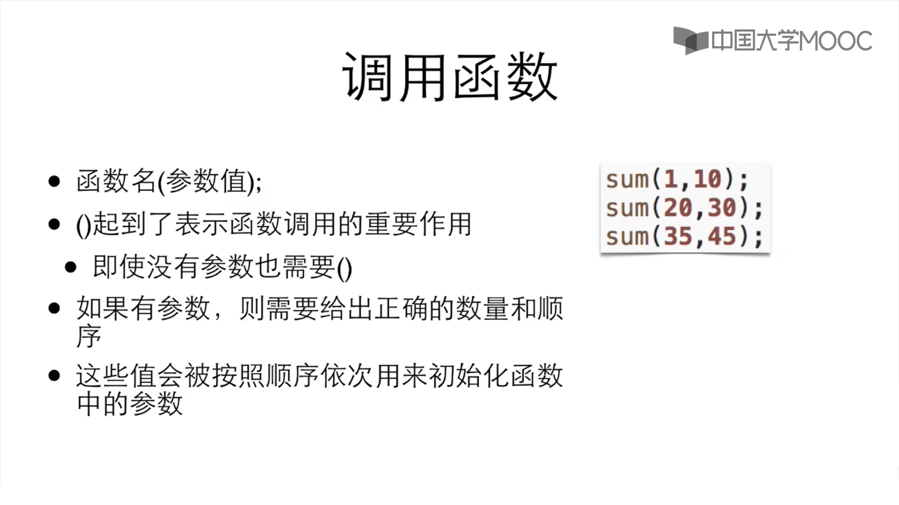
## 从函数中返回值
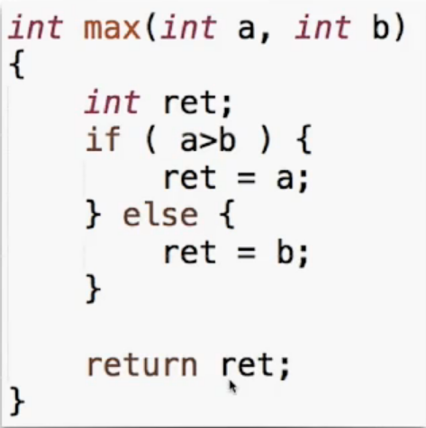
把ret交给调用函数的地方（当然你定义别的量也行）
 建议单一出口，便于后期修改
 ### 没有返回值的函数
 * void 函数名(参数表)
 * 不能使用带值的return
   * 可以没有return
 * 调用的时候不能做返回值的赋值

## 函数原型
* sum()写在上面是因为C的编译器自上而下分析你的代码
* 所以当看到sum(1,10)的时候，他知道sum()的样子
* 三要素：名称，参数（数量和类型）
* 返回类型

倘若不想把长长的sum(){}放开头，就在开头扔一个声明函数（函数原型）sum();
接着把你定义的函数扔后面（它这时候叫定义函数），免得编译器瞎猜
这也是为什么Frank说复制粘贴就行
编译器只检查声明函数中的类型，但对人类读者来说，还是必要的

## 参数传递
==C语言在调用函数时，永远值传值给函数==
所以swap(a,b)函数一般传了个寂寞，还得看指针

## 本地变量（概念理解可跳转到Frank的函数作用域）
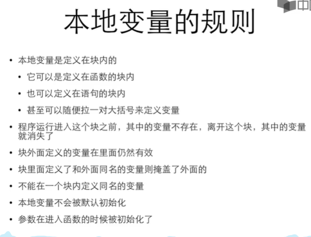
>对于最后一句话，调用函数的时候一定要给参数对应的值以在进入函数的时候初始化参数

## 一些注意事项
1. ==原型里面一定要把参数写全==（没有的话就写void），当在参数表里放了void，那就是明确告诉编译器：这个函数不接收任何的参数，但要是啥都不写，编译器就会猜参数类型，一旦后面你定义的类型不一样，那就error了
2. 可以在一个函数放另一个函数的声明，但不能放另一个函数的定义
3. main函数是一个函数，所以return 0时有意义的，main函数在结束的时候要把0返回给调用它的地方告诉系统，函数返回了什么值

# 数组

## 基础

* ==数组中所有的元素具有相同的数据类型==
* 一旦创建，不能改变大小
* 数组中元素在内存中时依次排列的
* 在赋值左边的值叫做左值
* 数组长度得是确定的，但是可以通过先定义一个数字数量x，让用户输入数字数量，再int number[x]
* （个人的想法：能否通过检测用户输入数量来控制for循环的i<x）

==以下代码只能在C标准运行，因为const本质上会定义一个只读变量，不可以更改，而编译时检查常量值的类型是否匹配==
```c
#include <stdio.h>

int main()
{
	const int number = 10;//数组大小
	int x;
	int count[number];//定义数组
	int i;
	//初始化数组
	for ( i = 0; i < number; i++)
	{
		count[i] = 0;
	}
	scanf_s("%d", &x);
	while (x!=-1)
	{
		if (x>=0&&x<=9)
		{
			count[x]++;//数组参与计算
		}
		scanf_s("%d", &x);
	}
	for ( i = 0; i < number; i++)
	{
		printf("%d:%d\n", i, count[i]);
	}
	return 0;
}
```

## 数组运算

* #sizeof给出整个数组所占据内容的大小，单位是字节

* 一个数占4个字节，假如一个数组总长度是24，那用24/4就可以知道数组有几个数

* 对于sizeof(a)/sizeof(a[0])，sizeof(a[0])给出数组单个元素的大小，于是相除就得了数组的单元个数

* 这样的代码，一旦修改数组中初始的数据，不需要修改遍历的代码

* 不能拿一个数组赋给另一个数组，要把一个数组的所有元素交给另一个数组，必须采用遍历

  > for ( i=0; i＜length; i++ ) ｛b[i] = a[i];｝

* 通常都是使用for循环，让循环变量i从0到<数组的长度，这样循环体内最大的i正好是数组最大的有效下标

* 循环结束条件==不能==＜=数组长度
* 离开循环后==不要==继续用i的值做数组元素的下标
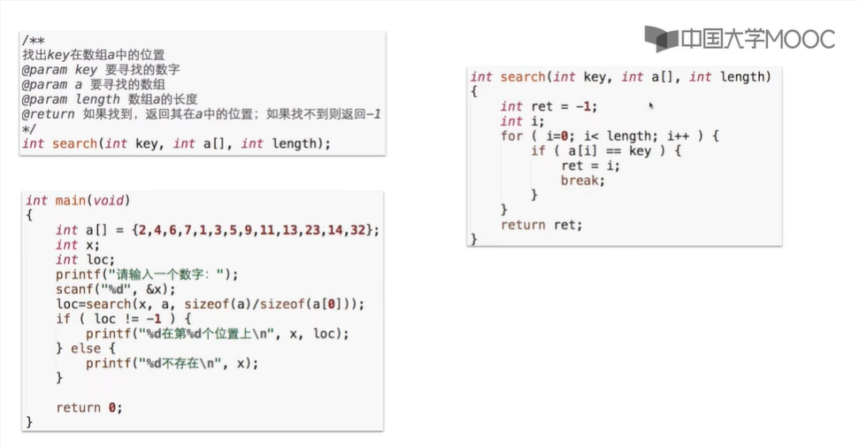

* 数组作为函数参数时，往往必须采用另一个参数来传入数组的大小
  * 不能在[ ]中给出数组的大小
  * 不能再用sizeof来计算数组的元素个数

## 数组练习：素数
* 算素数的话只要走到sqrt(x)就够了
* ==更快捷的是直接判断是否能被已知的且小于x的素数整除，因为比他小的非素数也是由多个素数相乘得到的==
	>因为一个数的因子都是成对出现的，而其开根号就是分界线。

Linux中man是manual的意思（参考手册）
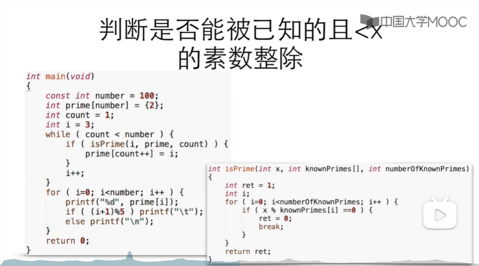
>让count++是为了把cnt1，也就是3，输到1号位，并且在输完后跳到2号位等待下一次输入（0号位拿来输第一个素数2了）

更进一步的算法是先假设所有的书都是书书，然后，再从前面开始，一个个删掉它的倍数，留下来的数就是素数
>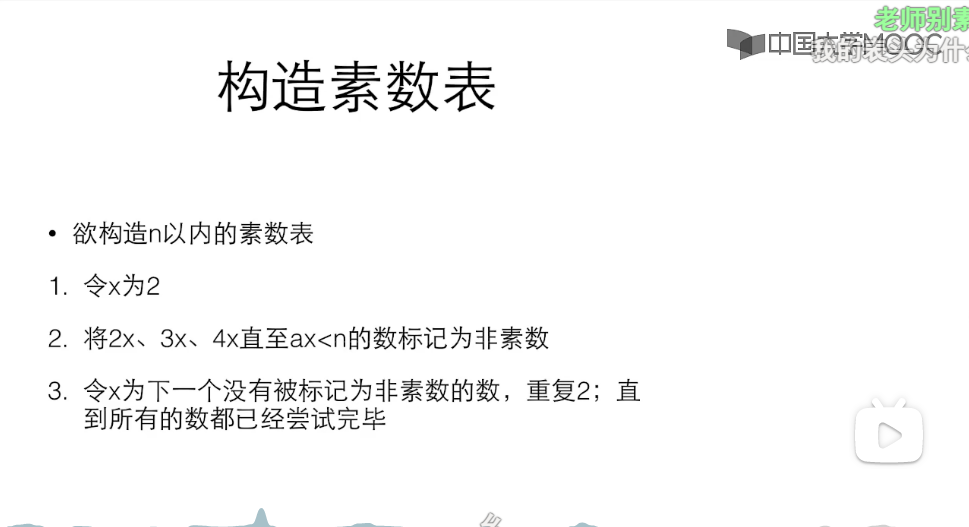
>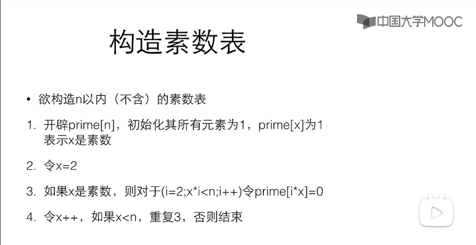
>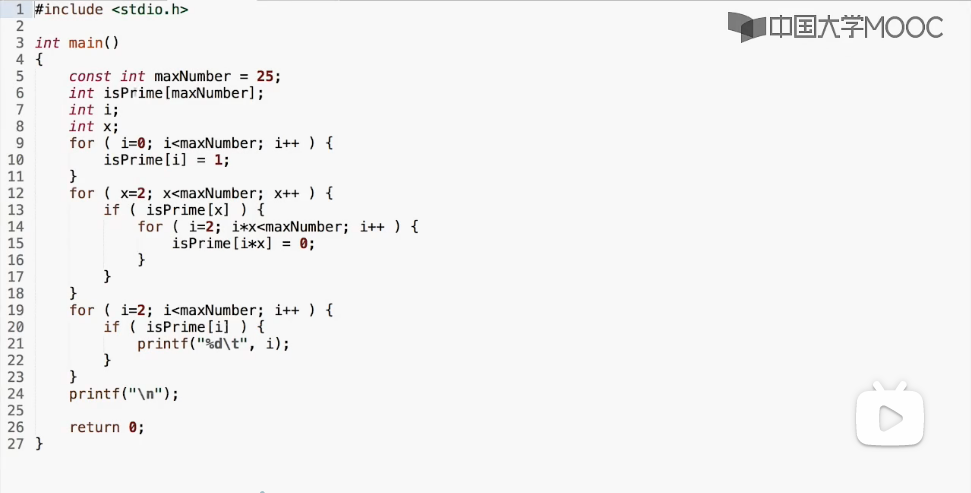
>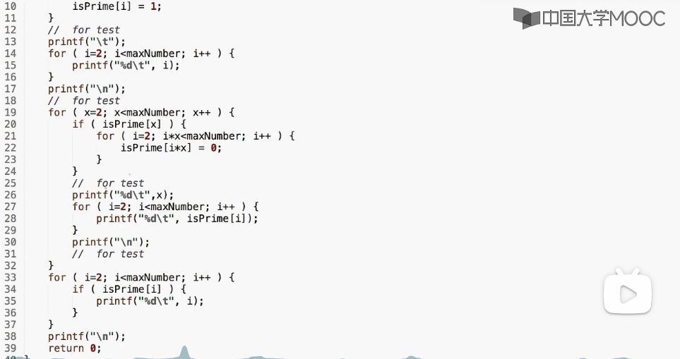
>上面是用打印来输出可视化结果

### 实操(==思考题：某个值到某个值以内的素数怎么搞==)
```c
//思考流程

//数组内值都为1
//从2开始取为1的值
//范围内2的倍数变成0
//3是1，3的倍数变0
//输出数为1的下标
//每5个素数一换行

#include<stdio.h>
int main(void)
{
	const int max = 97;
	int i;
	int times;
	int prime[97];
	int enter = 0;

	//初始化数组所有数为1
	for (i = 0; i < max + 1; i++)
	{
		prime[i] = 1;
	}

	//从下标2开始，下标2倍数的值为0
	for (i = 2; i < max + 1; i++)
	{
		for (times = 2; i * times < max + 1; times++)
		{
			prime[i * times] = 0;
		}
	}

	//从第一个素数2开始读
	for (i = 2; i < max + 1; i++)
	{
		if (prime[i] == 1)
		{
			enter++;
			(enter % 5 == 0) ? printf("%d\n", i) : printf("%d\t", i);
		}
	}

	return 0;
}
```

## 二维数组
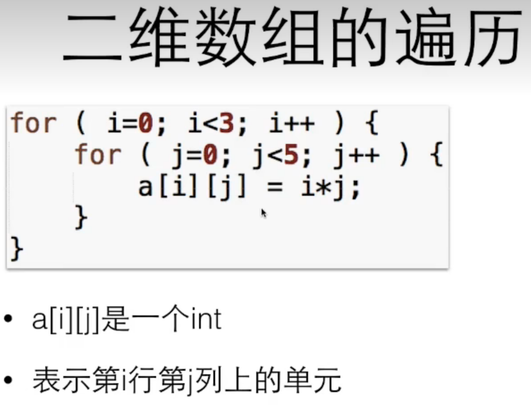
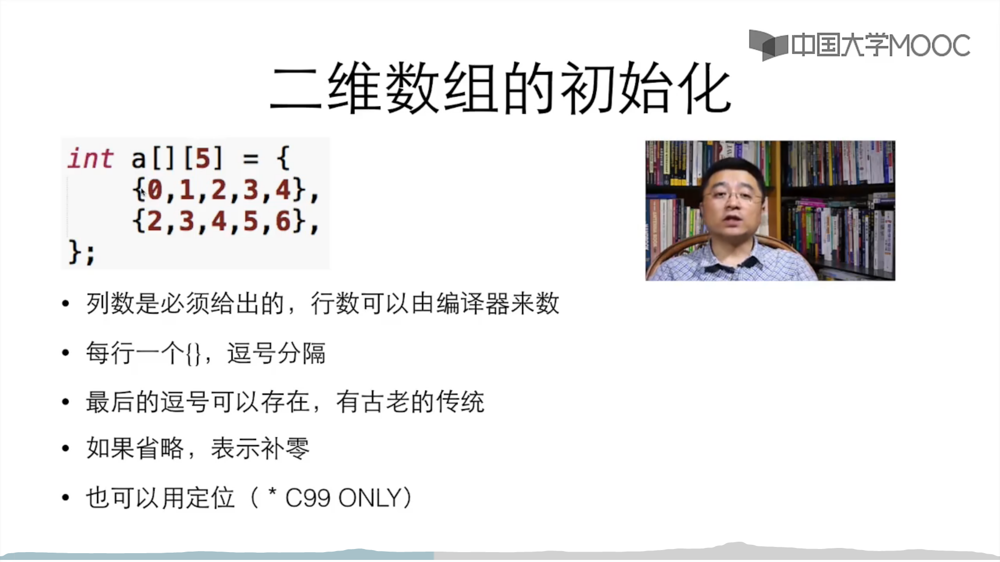
### 以井字棋为例
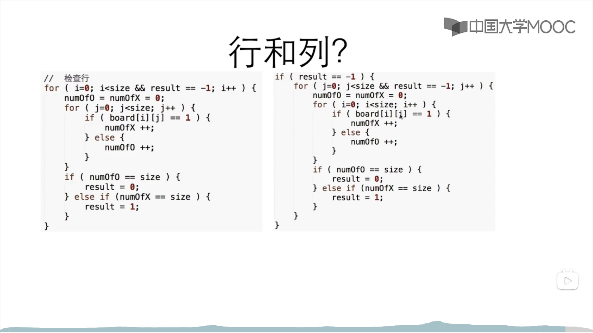
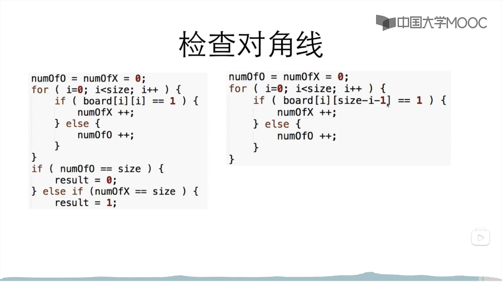
个人的思考：检查对角线

