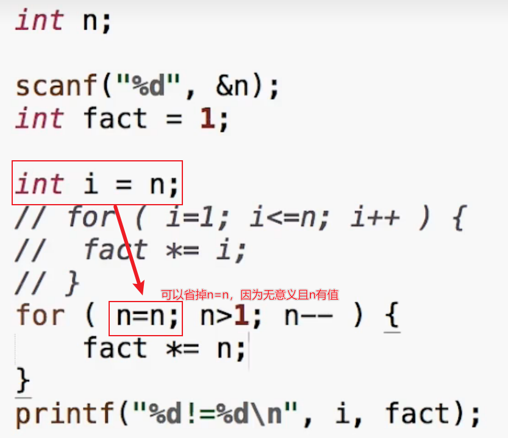

# 数据类型
* 整数
 * int
 * printf("%d",...)
 * scanf_s("%d",...)
* 带小数点的数
 * double
 * printf("%f",...)
 * scanf_s("%lf",...)

# 表达式
计算时间差
```c
int hour1, minute1;
int hour2,minute2;

scanf("%d %d", &hour1, &minute1);
scanf("%d %d", &hour2, &minute2);

int t1 = hour1 * 60 + minute1;
int t2 = hour1 * 60 + minute2;

int t = t2 - t1;

printf("时间差是%d小时%d分。", t/60, t%60);
```

# 求平均值
```c
int a,b;

scasnf("%d %d"，&a, &b);

double c = (a+b)/2.0;

printf("%d和%d的平均值=%f\n",a ,b ,c);
```

# 优先级
连续运算：从左到右
算术运算 > 关系运算符 > 赋值运算 > ==和!=
> 对6>5>4，6>5正确，返回1，1>4错误，返回0
> a == b == 6也是如此

# 嵌套if-else练习
```c
#include<stdio.h>

int main(void)
{
	int a, b, c;
	scanf_s("%d %d %d", &a, &b, &c);

	int max = 0;

	if (a > b)
	{
		if (a > c)
		{max = a;}
		else { max = c; }
	}
	else {
		if (b > c) {max = b;}
		else { max = c; }
	}
	printf("max = %d", max);//单一出口：最后printf一次那就好了
	return 0;
}
```

# if和else if的区别

你写的不是关系，不是说明，而是步骤

```c
#include<stdio.h>

int main(void)
{
	int age;
	printf("please input your age\n");
	scanf_s("%d", &age);
	if (age > 999) { printf("是四位数\n"); }
	else if (age > 99) { printf("是三位数\n"); }
	else if (age > 9) { printf("是两位数\n"); }
	return 0;
}
```

上面的else if若换成if，则程序会一直判断下去，而else if如果符合，直接跳出判断

# while小练习

```c
#include<stdio.h>

int main(void)
{
	int 数字;
	int 位数 = 0;
	printf("请输入数字\n");
	scanf_s("%d", &数字);
	if (数字 < 0) { 数字 = -数字; }
	while (数字 > 0)
	{
		位数++;
		数字 = 数字 / 10;
	}
	printf("这是%d位数\n", 位数);
	return 0;
}
```

# 计算前保留原始数据

```c
int x;
int ret = 0;

scanf_s("%d", &x);
int t = x;//t用于储存x初始值
while (x>1) {x /= 2; ret++;}
printf("log2 of %d is %d", t, ret);
return 0;
```

# 数字炸弹
[随机数进阶教程](https://cubox.pro/my/card?id=ff808081828c15960182916422985e03)

```c
#include <stdlib.h>
#include <stdio.h>
#include <time.h>

//随机数 
int main()
{
	srand((unsigned)time(NULL));//用于改变rand

	int 随机值;
	int 首数;
	int 尾数;
	int 输入值 = 0;//用户输入的数

	//初始化：检验首尾合法
	do
	{
		printf("请输入首数\n");
		scanf_s("%d", &首数);
		printf("请输入末数\n");
		scanf_s("%d", &尾数);
		(首数 < 尾数) ? printf("数字在%d到%d间\n", 首数, 尾数) : printf("输入不合法，请重新输入\n");
	} while (首数 > 尾数);
	随机值 = (rand() % (尾数 - 首数 + 1) + 首数);

	//输入与识别(防止初始化输入错误)
	printf("请输入区间内的一个数\n");
	scanf_s("%d", &输入值);
	while ((输入值 != 随机值) || (尾数 - 首数 == 2))//如果不等于
	{
		while ((输入值 < 首数) || (输入值 > 尾数))//输入数字不超区间(防止过程输入错误)
		{
			printf("输入不合法，请重新输入\n");
			scanf_s("%d", &输入值);
		}

		if (输入值 < 随机值)//移头
		{
			首数 = 输入值;
			printf("数字在%d到%d间", 输入值, 尾数);
		}

		else//移尾
		{
			尾数 = 输入值;
			printf("数字在%d到%d间", 首数, 输入值);
		}

		//下一次运算
		printf("请输入区间内的一个数\n");
		scanf_s("%d", &输入值);
	}

	printf("恭喜你中了！随机数就是%d\n", 随机值);
	return 0;
}
```
# 随机数
每次召唤rand()就得到一个随机的整数
## 取余
x % n 的结果是[0,n-1]的一个整数

# 练习：算平均数



# 循环的选择
若有固定的次数，用for（起点终点明确）
若必须执行一次，do-while
其他情况用while

# break在循环中(有点意思)：判断素数
对于下式
```javascript {.line-numbers}
#include <stdlib.h>

int main()
{
	int x;
	int i;
	scanf("%d", &x);
	int temp = 1;//用于暂存结果
	for (i = 2; i < x; i++) {
		if (x % i == 0) {
			temp = 0;
			break;//在break内，碰到break就跳出循环
			//不加break会导致后面的结果覆盖temp当前值：0
		}
	}
	if (temp = 1) { printf("是素数\n"); }//若从始至终temp都不终止输出0（保持为1），则为素数
	else { printf("不是素数"); }
	system("PAUSE");
	return 0;
}
```
碰到break就跳出循环
continue是这一轮没做的东西不做了，继续下一轮

# for循环条件的使用：计算前50个素数

在这个基础上，


# 当内层break，整个程序break
## 法一：传统教科书

## 法二：在goto后写一个标号（下面以out为标号举例）
out相当于一个传送门，goto是开关


# 求和（for的运用）

## 变式


# 整数分解
## 加空格
让字符和空格分别输出，以x当前值是否为个位数（int环境下除10是否等于0）来判断

## 逆序：依次夺取最高位输出
```c
#include <stdio.h>

int main()
{
	int 输入;
	printf("请输入一个数用于倒序\n");
	scanf_s("%d", &输入);
	while (输入 > 0)
	{
		printf("%d", 输入 % 10);
		输入 /= 10;
		if (输入 != 0){printf(" ");}
	}

	return 0;
}
```

# 求最大公约数：辗转相除法（枚举效率低）

# 数据类型
unsigned表示这个数字不以补码的形式来表现（不把第一位看作补码）
unsigned的初衷是为了做纯二进制运算，主要是为了移位（想让最高位的一不起作用）
以翁恺老师画的图来举例

unsigned char a = 0
a = a - 1
那么最终a输出为255
若a开始为255，那么经过a = a + 1，a最终为0，因为char只有8个比特，进位的第九个比特被挤出去了

# 整数的输入输出
## 形式
* 只有两种形式：int或long long
  * %d：int
  * %u：unsigned
  * %ld：long long
  * %lu：unsigned long long
当我们把所有小于int的变量传给printf的时候。编译器会把这些变量转换为int传进去。

## 进制
**以%d（十进制）输入的时候，**
以0开始的数字字面量是八进制
以0x开头的数字字面量是16进制
但是==%d==的printf只会输出10进制

## ==选择整数类型==
* 为了准确表达内存做底层程序的需要，所以要分这么多种整数
* ==如果没有特殊需要，就选择int==，原因是现在的CPU字长普遍是32位或64位，一次内存读写就是一个int一次计算，也是一个int，选择更短的类型不会更快，甚至可能更慢。
* 现代的编译器一般会设计内存对齐，所以更短的类型实际在内存中有可能也占据一个int的大小。（虽然sizeof告诉你更小）
* Unsigned与否只是输出的不同，内部计算是一样的。

## double和float

中间有一小段是无法表达的


# 浮点数
## 表达
nan：不是一个有效数字
%e:输出科学计数法
%.16f：小数点后输出16位小数（会四舍五入）
## 范围和精度
计算机浮点数中，两个数之间是存在最小距离的，当真实输出的数离谁近，实际输出数就是谁
printf输出inf表示超过范围的浮点数（－inf是－∞）
printf输出nan表示不存在的的浮点数
无穷大不能用整数来表达，但可以用浮点数来表达
带小数点的字面量是double，float需要用F或f后缀来表明身份f1==f2可能失败
fabs(f-f2)<1e - 8//看看绝对值是不是小于很小的数
不要用浮点数做精确运算，不然会累计误差，用小单位运算，如算钱用“分”
## ==总结==
==没有特殊需要，只用double
scanf只能读int不能读char
％d后没有空格，那就是读到连续的整数为止，后面的给下一个读（==有空格的情况没学会==）
==字符理解欠佳==
# 逃逸字符
\b：回退一格，让下一个字符在这里输出（可以覆盖原内容）
\t等于按一下Tab，Tab是在一行中固定位置而不是固定的字符数量，这个叫做到下一个制表位

>回车是回到行初
换行是切换到下一行(源于打字机)

现在的回车自动换行
# 自动类型转换
* 对于printf，任何小于int会被转换为int；float会被转换成double
* 但是scanf不会要输入short，需要％hd

# 强制类型转换
通常为大转小，=格式为：(类型)值==
>(int)10.2

转换方式参考前面翁恺老师画的时钟图（加减分钟）
强制类型转换的优先级高于四则运算，所以运算记得加括号
>int i = (int)(a / b)
==布尔类型尚不掌握==

# 逻辑运算
判断一个字符是否是大写字母：
>c>='A' && c <= 'Z'

index不在0~99范围内：
>index < 0 || index > 99

age大于等于20：
>!age < 20

## 短路
以a==6 && b==1为例，若前式不成立，则判断结束
所以==不要把任何赋值组合到表达式内（包括a＋＋）==

# 函数
**为了避免后续维护复杂，请尽量使用函数**
## 调用函数

## 从函数中返回值

把ret交给调用函数的地方（当然你定义别的量也行）
 


# 逃逸字符


# 函数
