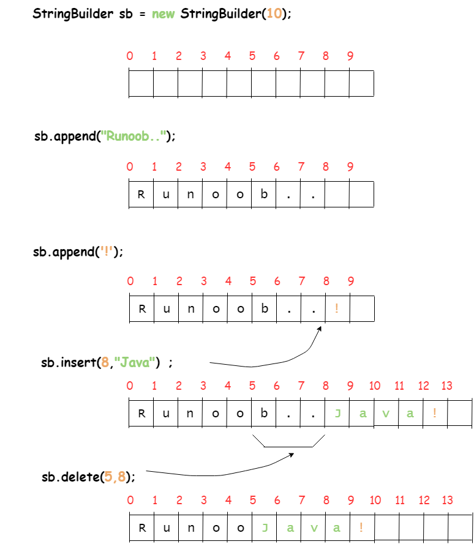
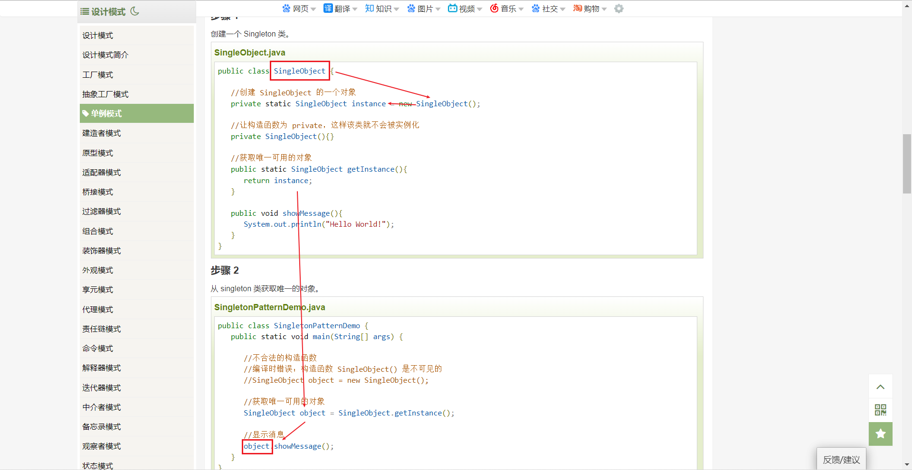

# 格式
Java每个文件命名一定是开头大写
```java
public class Main {
    public static void main(String[] args){
        System.out.println("Hello");
    }
}
```
菜鸟教程增补：
> 基本语法
编写 Java 程序时，应注意以下几点：
    * 大小写敏感：Java 是大小写敏感的，这就意味着标识符 Hello 与 hello 是不同的。
    * 类名：对于所有的类来说，类名的首字母应该大写。如果类名由若干单词组成，那么每个单词的首字母应该大写，例如 MyFirstJavaClass 。
    * 方法名：所有的方法名都应该以小写字母开头。如果方法名含有若干单词，则后面的每个单词首字母大写。
    * 源文件名：源文件名必须和类名相同。当保存文件的时候，你应该使用类名作为文件名保存（切记 Java 是大小写敏感的），文件名的后缀为 .java。（如果文件名和类名不相同则会导致编译错误）。
    * 主方法入口：所有的 Java 程序由 public static void main(String[] args) 方法开始执行。
# 运行
class文件通过Java虚拟机实现跨平台运行，包名命名时，一个.就是一个文件夹

# 第一个程序
输出：sout加Tab键
for循环：fori然后回车
> for循环中length是变量不是函数，不用加括号
侧栏展开：alt+1
快速对齐：Ctrl+Alt+L
快速生成变量：CTRL+ALT+V或者在没加分号时句末加.var
主函数：psvm或者main
输出离它最近的那个变量：soutv+回车
多行注释：/*+回车
快捷注释：ctrl+/
方法注释：/**+回车
撤回：ctrl+z
```java
package com.google;//用来定位Main文件在哪

//公共的 类  类名
public class Main {//win上新建类ctrl+alt+insert

    //main函数：程序入口点
    public static void main(String[] args) {
        int number_a = 1, number_b = 2;
        int sum = sum(number_a, number_b);//在写完sum(number_a, number_b);后再按一下CTRL+ALT+V
        System.out.println("sum = " + sum);
        System.out.println("Hello");
    }

    public static int sum(int number_a, int number_b) {
        return number_a + number_b;
    }
    
}
```

# 注释和文档
**文档要在指定的目录生成，别在原文档生成**
说“方法”不说“函数”
快速文档：ctrl+q
```java
//类注释示例
/**
 * 该方法传递两个int类型参数，用来求和
 * @param number_a 第一个加数
 * @param number_b 第二个加数
 * @return 返回一个求和后的结果
 */
public static int sum(int number_a, int number_b) {
    return number_a + number_b;
}
```

# 一带而过
常量定义；
> final int a = 1；

# 字符串演示
## 字符串语法
可以通过提供一个字符数组参数来初始化字符串
```java
public class StringDemo{
   public static void main(String args[]){
      char[] helloArray = { 'r', 'u', 'n', 'o', 'o', 'b'};
      String helloString = new String(helloArray);  
      System.out.println( helloString );
   }
}
```
**注意**:==String 类是不可改变的==，所以你一旦创建了 String 对象，那它的值就无法改变了

如果需要对字符串做很多修改，那么应该选择使用 StringBuffer & StringBuilder 类

## StringBuffer 和 StringBuilder 


## .length()的使用
==for循环中length是变量不是函数，不用加括号==
```java
public class Main {
    public static void main(String[] args){
        String str_1 = "hello";
        String str_2 = "world";

        System.out.println("str_1 -> length : " + str_1.length());
        for (int i = 0;i<str_1.length();i++){
            
        }
    }
}
```

## 连接字符串
> "hello" + "world"

# 导包(在class上面导)
> import com.microsoft.tools.Student//精确到类来告诉程序你想用谁家的Student
> ......tools.*//代表tools下面的所有包

包用到时会自动导，但要注意有没有导对

# 数组
不输值默认0
## 静态数组
```java
//法一：初始化
int[] arr_1 = {1,2,3,4};
//法二：分配空间
int[] arr_1 = new int[5];
arr_1[0] = 1;
arr_1[1] = 2;
```
### 增强for循环：for each
```java
double[] mylist = {1.9, 2.9, 3.9, 4.9};
//打印所有数组元素
//每个元素类型 element: 数组名
for (double element: mylist) {
    System.out.println(element);
}
```
## Arrays（util的）
### sort排序
```java
int[] arr_1 = {1426, 42, 53, 4, 5, 365, 67, 70};
Arrays.sort(arr_1);//排序

//for each遍历
for(int element: arr_1) {
    System.out.println(element);
    }
```
### search二分查找(要先排序)
```java
package com.google;

import java.util.Arrays; 

public class Main {
    public static void main(String[] args){
        int[] arr_1 = {1426, 42, 53, 4, 5, 365, 67, 70};
        Arrays.sort(arr_1);//排序
        //for each遍历
        for(int e
                : arr_1) {
            System.out.println(e);
        }
        //二分查找
        int result_index = Arrays.binarySearch(arr_1,1426);
        System.out.println("result_index = " + result_index);
    }
}
```
### 相等
```java
package com.google;
import java.util.Arrays;
public class Main {
    public static void main(String[] args){

        //相同顺序且相同元素
        int[] arr_1 = {1,2,3};
        int[] arr_2 = {1,2,3};
        
        boolean b = Arrays.equals(arr_1, arr_2);//按完Arrays.equals(arr_1, arr_2)按ctrl+alt+v再按回车
        System.out.println("b = " + b);

    }
}
```
### fill填充
```java
package com.google;

import java.util.Arrays;

public class Main {
    public static void main(String[] args) {
        int array[] = new int[6];//建数组
        Arrays.fill(array, 100);//数组每个数填成100

        for (int i = 0; i < array.length; i++) {
            System.out.println(array[i]);
        }

        System.out.println();

        Arrays.fill(array, 3, 6, 50);//下标3到6换成50

        for (int i = 0, n = array.length; i < n; i++) {
            System.out.println(array[i]);
        }
    }
}
```

# 方法的重载（方法名复用性）
1. 方法名相同
2. 参数个数和参数类型不相同
==只要符合以上条件，系统就可以自选符合的方法调用==

```java
public class Main {
    public static void main(String[] args) {

        //方法的重载
        int sum1 = sum(1, 2);
        double sum2 = sum(1.2, 3.4);
        System.out.println("sum1 = " + sum1);
        System.out.println("sum2 = " + sum2);
    }

    public static int sum(int x, int y) {
        return x + y;
    }

    public static double sum(double x, double y) {
        return x + y;
    }
}
```
从Java中数组中也可见一斑
> Arrays.sort()中括号填什么类型都可以

---

* 面向过程(POP)：你想去做什么的时候，然后去做了，这就是过程
  走一步看一步，目标不明确，不适用大众
* 面向对象(OOP)：大众化，有目标，不强调过程
  设计思维：先考虑共性：所有该种类都具备的东西

---

# 面向对象：封装、继承、多态
```java
package com.microsoft.bean;

// 狗都有这些
// 类当中的变量和方法都统称为属性（共性、特性）
public class Dogs {
    // 下面几个是成员变量，他们组成了类，他们也是属性
    // 狗名字
    public String name;// 加public让大家都能填

    // 狗种类
    public String variety;

    // 狗年龄
    public int age;

    // 这些方法在类当中都叫行为
    public void eat(){
        System.out.println(name + "正在吃饭");
    }

    public void sleep(){
        System.out.println(name + "正在睡觉");
    }

    public void sick(){
        System.out.println(name + "在生病");
    }
}
```
```java
import com.microsoft.bean.Dogs;

public class Application {
    public static void main(String[] args) {
        // 张大爷注册
        Dogs zhangDog = new Dogs();

        // 设置狗的信息
        zhangDog.name = "Jerry";
        zhangDog.age = 2;
        zhangDog.variety = "拉布拉多";

        //王阿姨注册
        Dogs wangDog = new Dogs();

        wangDog.name = "Tom";
        wangDog.age = 2;
        wangDog.variety = "藏獒";

        System.out.println("张大爷的狗叫" + zhangDog.name);
        System.out.println("王阿姨的狗叫" + wangDog.name);

        //张大爷的狗睡觉了
        zhangDog.sleep();//看到sleep()先找Dogs这个类，再找sleep()这个函数
        //王阿姨的狗在吃饭
        wangDog.eat();
    }

}

```
## 注销账户和null空指针异常
对象(zhangDog)都没了，如果还操作人家的属性(println name)，那就会NullPointerException，解决办法是不输出它的名字了

## OOP封装(Getter and Setter)
封装好让大家直接用，但又不能提供过多的权限导致安全问题
```java
package com.microsoft.bean;

public class Dogs {
    // 狗名字
    private String name;// 加private让用户不能为所欲为
    // 狗种类
    private String variety;
    // 狗年龄
    private int age;


    // 我们要让用户一个能设置，能获取但不能瞎搞 -> getset
    /* 
    this.age是上面private的age，
    详细来说作用对象zhangDog的age（因为传的是zhangDog）,
    int age是用户传进来的age
    */
    public void setAge(int age) {
        if (age < 0 || age > 34) {
            System.out.println("您输入的数据不合法，已经默认清零！");
            this.age = 0;
        } else {
            this.age = age;
        }
    }

    public int getAge() {
        return this.age;
    }

    /*
    此时，为了方便给每个成员设置getset，可以使用自动生成的方式
    alt+insert -> Getter and Setter -> ctrl+a全选 -> 回车

    以下是生成效果
     */

    public String getName() {
        return name;
    }

    public void setName(String name) {
        this.name = name;
    }

    public String getVariety() {
        return variety;
    }

    public void setVariety(String variety) {
        this.variety = variety;
    }
}

```
```java
import com.microsoft.bean.Dogs;

public class Application {
    public static void main(String[] args) {
        Dogs zhangDog = new Dogs();
        zhangDog.setAge(14);
        System.out.println("zhangDog age = " + zhangDog.getAge());
    }
}

```

## Lombok(==这只是工具，不要忘了getset怎么写==)
```java
package com.microsoft.bean;

//下面两行开始时是没有的

import lombok.Getter;
import lombok.Setter;

//看下面！（这俩建议写类上面）
@Getter
/*
先在最大的文件夹下新建个目录叫jar，
拖lombok...jar文件进去，右键添加为库，
ok，alt+shift+回车
*/
@Setter//现在按alt + 回车

public class Dogs {
    // 狗名字
    private String name;
    // 狗种类
    private String variety;
    // 狗年龄
    private int age;

    //特殊的单独写就行了：方法的重写
    public void setAge(int age) {
        if (age < 0 || age > 34) {
            System.out.println("您输入的数据不合法，已经默认清零！");
            this.age = 0;
        } else {
            this.age = age;
        }
    }

    public int getAge() {
        return this.age;
    }

}

```
```java
import com.microsoft.bean.Dogs;

public class Application {
    public static void main(String[] args) {
        Dogs zhangDog = new Dogs();
        zhangDog.setAge(-14);
        System.out.println("zhangDog age = " + zhangDog.getAge());
    }
}

```

## toString()
Dogs类
法一（不依赖Lombok）
```java
package com.microsoft.bean;

import lombok.Getter;
import lombok.Setter;

@Getter
@Setter

public class Dogs {
    // 狗名字
    private String name;
    // 狗种类
    private String variety;
    // 狗年龄
    private int age;
    private String food;

    public void setAge(int age) {
        if (age < 0 || age > 34) {
            System.out.println("您输入的数据不合法，已经默认清零！");
            this.age = 0;
        } else {
            this.age = age;
        }
    }

    public int getAge() {
        return this.age;
    }

    //alt + insert选toString
    //@符号后面添加的叫注解
    @Override//重写，后面会讲
    public String toString() {
        return "Dogs{" +
                "name='" + name + '\'' +
                ", variety='" + variety + '\'' +
                ", age=" + age +
                ", food='" + food + '\'' +
                '}';
    }
}

```
法二：利用Lombok的@
```java
package com.microsoft.bean;

import lombok.Getter;
import lombok.Setter;
import lombok.ToString;

@Getter
@Setter
@ToString //看这里！如果还想加上equals()、hashCode()那就直接写@Data

public class Dogs {
    // 狗名字
    private String name;
    // 狗种类
    private String variety;
    // 狗年龄
    private int age;
    private String food;

    public void setAge(int age) {
        if (age < 0 || age > 34) {
            System.out.println("您输入的数据不合法，已经默认清零！");
            this.age = 0;
        } else {
            this.age = age;
        }
    }

    public int getAge() {
        return this.age;
    }
    //后面就不用啦
}

```
Application类
```java
import com.microsoft.bean.Dogs;

public class Application {
    public static void main(String[] args) {
        Dogs zhangDog = new Dogs();
        zhangDog.setName("Jerry");
        zhangDog.setVariety("拉布拉多");
        zhangDog.setAge(10);
        System.out.println("zhangDog = " + zhangDog);//这里直接println zhangDog
    }
}

```

## 构造方法（构造器是为了初始化对象）
* 初始化 定义+使用
  ```java
    int[] arrDogs = {1,2,3,4};
  ```
* 先定义后使用
  ```java
    int[] arr = new int[4];
    arr[0] = 1;
  ```

### 示例
* ```java
    public void Dogs() {
        //空参的构造函数，什么都不传
    }
    ```
* ```java
    package com.microsoft.bean;
    
    import lombok.Getter;
    import lombok.Setter;
    import lombok.ToString;
    
    @Getter
    @Setter
    @ToString//看这里！
    
    public class Dogs {
        private String name;
        private String variety;
        private int age;
        private String food;
    
        // 构造方法别加类型，所以也别加void
        //可能会有人啥都不想填，所以先留着
        public Dogs() {
    
        }
        /*
        只要创建类如Dogs zhangDog = new Dogs()，
        就默认无参数构造上面这种函数,又称无参构造器
        但此例下面还写了个有参构造器，所以必须创建
        */
    
        //下面这里，alt + insert构造函数
        public Dogs(String name, String variety, int age, String food) {
            this.name = name;
            this.variety = variety;
            this.age = age;
            this.food = food;
        }
    }
    
    ```
    ```java
    //可以注册完成之后，再补充资料
    import com.microsoft.bean.Dogs;
    
    public class Application {
        public static void main(String[] args) {
        
            Dogs zhangDog = new Dogs();
            zhangDog.setName("Jerry");
            zhangDog.setVariety("拉布拉多");
            zhangDog.setAge(10);
    
            System.out.println("zhangDog = " + zhangDog);
        }
    }
    
    //也可以一开始就写资料
    import com.microsoft.bean.Dogs;
    
    public class Application {
        public static void main(String[] args) {
            Dogs zhangDog = new Dogs("Jerry","拉布拉多",2,"null");
            System.out.println("zhangDog = " + zhangDog);
        }
    }
    
    ```
    还有件事，看出来下面是啥了吗
    没错，就是==重载==，构造方法也可以重载的
```java
public Dogs() {

}
public Dogs(String food) {
    this.food = food;
}

public Dogs(String name, String variety, int age, String food) {
    this.name = name;
    this.variety = variety;
    this.age = age;
    this.food = food;
}
```
## 关于this
**this指的就是对象**,你不写也行，写了也直接相当于eat=eat，
前面是private的eat，后面是传进来的eat
* > this.age是上面private的age，
    详细来说作用对象zhangDog的age（因为传的是zhangDog）,
    int age是用户传进来的age
  
    详细用法在OOP封装那节
* 想要在eat()里调用上面的sleep()
  ```java
    public void sleep(){
        System.out.println(name + "正在睡觉");
    }
    
    public void eat(){
        System.out.println(name + "正在吃饭");
        this.sleep();
    }
  ```

## 垃圾回收
前文zhangDog = null;的做法并不能真正释放掉
一般都是自动垃圾回收
手动需要用System.gc();

## 静态变量和静态方法（立围墙区分自家小区和外来狗）
静态的东西用户是没法主动获取的
静态的好处是建立在class类上层的，和它的对象根本没关系
[Java static关键字（静态变量和静态方法）](https://ock.cn/qdirf)
[比喻版](https://www.zhihu.com/answer/28422467)

```java
package com.microsoft.bean;

public class Dogs {
    //小区名,不加public那边看不到
    public static String community = "NanG";
    /*
    现在用Application的都是NanG小区的，
    就算没有狗了也会说明系统是给小区用的
    这就是静态变量
     */

    //静态方法：小区里所有狗都得打针，王大爷不愿意也得让他的狗打
    public static void injection(){
        System.out.println("所有的狗，月底打针");
    }
}
```
```java
import com.microsoft.bean.Dogs;

public class Application {
    public static void main(String[] args) {

        System.out.println("Dogs.community = " + Dogs.community);//类名.静态属性
        Dogs.injection();
        /*
        静态的直接用类名访问，不用加对象了
        不用像eat(),sleep()那样new个Dogs
         */
    }
}
```
## private static
如果在Application类，有人加入了以下代码，那事儿就大了
```java
Dogs.community = "The hackers came";
```
所以还得是private，此时还想发挥静态类名访问的优势，就要这样
```java
package com.microsoft.bean;

public class Dogs {

    private static String community = "NanG";
    
    public static String getCommunity(){
        return community;//静态的就不用写this了，程序知道就这一个
    }
}
```
```java
import com.microsoft.bean.Dogs;

public class Application {

    //现在只能获取了，禁止操作小区
    public static void main(String[] args) {

        System.out.println("Dogs.community = " + Dogs.getCommunity());

    }
}
```

## 静态代码块
用途不多，看书，static包个代码块且只加载一次

## static单例模式

[几种单例模式](https://zhuanlan.zhihu.com/p/105586046)
贴个流程先

```java
package com.microsoft.bean;

public class Earth {
    //单例设计模式
    /*
    在这里自己new自己
    用static保证earth，不提供对外new的方法
     */
    private static Earth earthInstance = new Earth();//shift+f6改名

    //alt+insert构造，换private
    //因为下面private了所以Application new不了了
    private Earth() {
    }//禁止new Earth();

    public static Earth getEarthInstance() {
        return earthInstance;
    }

    public void hello() {
        System.out.println("hello");
    }
}
```
```java
import com.microsoft.bean.Dogs;
import com.microsoft.bean.Earth;

public class Application {
    public static void main(String[] args) {

        Earth earthInstance = Earth.getEarthInstance();

        earthInstance.hello();

    }
}
```

## 内部类（看书，开发基本不会这么写）
==一个文件只能有一个public的class，所以直接写class==
想要让外部访问要加public

## 需求重定义 -> 继承
如果养猫的和养老鼠的也想让系统管管
产生矛盾：
* 用一个类—>有特性
* 不用一个类->有共性
Animal类
```java
package com.microsoft.bean;

import lombok.Getter;
import lombok.Setter;
import lombok.ToString;

@Getter
@Setter
@ToString
public class Animal {
    private String name;

    private String variety;

    private int age;

    private String food;

    public void eat() {
        System.out.println(name + "正在吃饭");
    }

    public void sleep() {
        System.out.println(name + "正在睡觉");
    }

    public void sick() {
        System.out.println(name + "在生病");
    }

    private static String community = "NanG";

    public static String getCommunity() {
        return community;//静态的就不用写this了，程序知道就这一个
    }

    public static void injection() {
        System.out.println("所有的动物，月底打针");
    }
}
```
Dogs类
```java
package com.microsoft.bean;
//继承
//子类 extends 父类
public class Dogs extends Animal {

}
```
Cats类
```java
package com.microsoft.bean;

public class Cats extends Animal {
    
}
```
Application类
```java
import com.microsoft.bean.Cats;
import com.microsoft.bean.Dogs;

public class Application {
    public static void main(String[] args) {
        Dogs zhangDog = new Dogs();
        zhangDog.setName("Jerry");
        zhangDog.setAge(2);
        System.out.println("zhangDog = " + zhangDog);

        Cats liCat = new Cats();
        liCat.setName("Tom");
        liCat.setAge(3);
        System.out.println("liCat = " + liCat);

        zhangDog.sleep();
        liCat.eat();
    }
}
```
## 多层继承
==只能爹继承爷，儿子继承爹，不能儿子同时继承爷和爹==
Larbrador
```java
package com.microsoft.bean;

public class Labrador extends Dogs{
}

```
Application
```java
import com.microsoft.bean.Labrador;

public class Application {
    public static void main(String[] args) {

        Labrador labrador = new Labrador();
        labrador.setAge(5);
        System.out.println("labrador = " + labrador);

    }
}
```
## 方法的重写
参数类型或数量不同才是重载
和继承有关的才是重写，好处是可以让子类创造出不同于父类的、而是自己的方法
Animal类
```java
package com.microsoft.bean;

import lombok.Getter;
import lombok.Setter;
import lombok.ToString;

@Getter
@Setter
@ToString
public class Animal {
    private String name;

    private String food;

    public void eat() {
        System.out.println(name + "正在吃饭，吃的是" + this.food);
    }

    public void barking() {
        System.out.println("动物在叫");
    }

}

```
Dogs类
```java
package com.microsoft.bean;
//继承
//子类 extends 父类
public class Dogs extends Animal {
    //alt + insert，重写方法

    /*
    在子类中，凡是有@Override的标签，
    那它下面的方法一定是来自它父类的，但又不学它的父亲
    这是它自己拥有的特性，是它自己的，它革新了
    革新的内容就是方法体，override就是重写
    */
    @Override
    public void barking() {
//        super.barking();
        System.out.println("汪汪！");
    }
}
```
Cats类
```java
package com.microsoft.bean;

public class Cats extends Animal {
    @Override
    public void barking() {
//        super.barking();
        System.out.println("喵喵喵");
    }
}

```
Application类
```java
import com.microsoft.bean.Cats;
import com.microsoft.bean.Dogs;

public class Application {
    public static void main(String[] args) {

        Dogs zhangDog = new Dogs();
        zhangDog.setName("Jerry");
        zhangDog.setFood("狗粮");
        zhangDog.eat();

        Cats liCat = new Cats();
        liCat.setName("Tom");
        liCat.setFood("猫粮");
        liCat.eat();

        zhangDog.barking();
        liCat.barking();

    }
}

```

## super啃老
[java中子类构造方法和父类构造方法](https://blog.csdn.net/DTEzhihao/article/details/86765119)
方法重写了，假如又想用回父类的方法，那就用@Override自带的super
(该例中其余类与前例相同)
Cats类
```java
package com.microsoft.bean;

public class Cats extends Animal {
    @Override
    public void barking() {
        super.barking();
//        System.out.println("喵喵喵");
    }
}
```
我们会发现
```java
Dogs wangDog = new dog("Jerry",2);//error，不可以！
```
而
```java
Animal animal = new Animal;//可以的
```
**这是因为父类构造方法是绝对不能被子类继承的。**

子类构造方法调用父类的构造方法重点是：**子类构造方法无论如何都要调用父类的构造方法。**
子类构造方法要么调用父类无参构造方法（包括当父类没有构造方法时。系统默认给的无参构造方法），要么调用父类有参构造方法。

Dogs类
```java
package com.microsoft.bean;

public class Dogs extends Animal {

    //alt + insert构造函数，这下就可以用父类的构造方法了
    public Dogs() {
    }

    public Dogs(String name, String variety, int age, String food) {
        super(name, variety, age, food);//看到没，自动生成就有super
    }

    @Override
    public void barking() {
//        super.barking();
        System.out.println("汪汪！");
    }
}
```

## final
不要忘了Java开发手册的要求
> 常量命名全部大写，单词间用下划线隔开，力求语义表达完整清楚，不要嫌名字长
```java
public static final String TEXT_COMMUNITY_NAME = "NanG";
```
Animal类
```java
package com.microsoft.bean;

public class Animal {

    public static final String COMMUNITY_NAME = "NanG";
    
    public void barking() {
        System.out.println("动物在叫");
    }

}
```
Dog类
```java
package com.microsoft.bean;

public class Dogs extends Animal {

    //反例:若下面方法boolean前加final，则Labrador类无法重写
    //final 方法 不能被子类继承或者重写 想为所欲为操作遗产不可能，但可以用用返回值
    //final修饰变量时，此变量永远不能改，放static后，String前
    public boolean isGuideBlindness(){
        return false;
    }
}
```
Labrador类
```java
package com.microsoft.bean;

//拉布拉多是最下层了，后面没人继承它了
//final 最终 分不了了
/*
1. 遗产没人继承，也不可能被继承
 */
public final class Labrador extends Dogs{
    @Override
    public boolean isGuideBlindness() {
        return true;
    }
}

```
Application类
```java
import com.microsoft.bean.Labrador;

public class Application {
    public static void main(String[] args) {

        Labrador labrador = new Labrador();
        System.out.println(labrador.isGuideBlindness());

    }
}

```

## 新的问题：
* Animal没用，它是个抽象的东西，只能被继承（new Animal没有价值）
* 万一后面新增子类忘重写了某方法咋办

## 抽象类
Animal本质上来说是没有人用的，它是一个抽象的，他抽取了这些猫狗的共性，作为使用
抽象-----具体
动物-----狗
抽象的目的是为了解释（概括）具体的共性
Animal animal = new Animal();  ×
**所以，Animal类应该是这样的**
```java
//我们让Animal变成抽象类
public abstract class Animal {

}//现在开始，不能new Animal()了，因为没意义
```

## 抽象方法 ———— 不能有实际的意义 -> 你不知道Animal怎么叫的
**动物叫声太多了，你==没法具体到某一个指定的叫声==**
所以抽象方法不能加大括号
```java
public abstract void barking();
```
==如果写了抽象方法，那这个类必须是抽象类==
==现在开始，不能写super了，所有继承Animal的类，必须重写抽象的方法==
Animal类
```java
package com.microsoft.bean;

public abstract class Animal {

    public static final String COMMUNITY_NAME = "NanG";

    public abstract void barking();

}

```
Hamster类
```java
package com.microsoft.bean;

// 当一个类继承一个抽象类，此时该子类必须重写父类中所有抽象方法
public class Hamsters extends Animal {

    @Override
    public void barking() {
        System.out.println("吱吱吱");
    }
}

```
Application类
```java
import com.microsoft.bean.Hamsters;

public class Application {
    public static void main(String[] args) {
        Hamsters hamsters = new Hamsters();
        hamsters.barking();
    }
}

```

## 接口
如果Animal中所有的方法都是抽象的，那就没必要写抽象类了，
因为有个更好的东西：接口

Human接口
```java
//知道怎么用就行，后面Dao Service会学
package com.microsoft.bean;

//接口
//里面所有的方法都是抽象的
public interface Human {

    public void eat();

    public void run();

}
```
Chinese类
```java
package com.microsoft.bean;

// 实现接口
//划红波浪线了，alt + 回车，实现方法

// 类中的方法我们可以叫重写
// 但在接口中，我们叫：实现
public class Chinese implements Human{
    @Override
    public void eat() {
        System.out.println("吃中餐");
    }

    @Override
    public void run() {
        System.out.println("养生跑");
    }
}
```
Westerner类
```java
package com.microsoft.bean;

public class Westerner implements Human{
    @Override
    public void eat() {
        System.out.println("吃西餐");
    }

    @Override
    public void run() {
        System.out.println("小跑");
    }
}
```
```java
import com.microsoft.bean.Chinese;
import com.microsoft.bean.Westerner;

public class Application {
    public static void main(String[] args) {
        Chinese chinese = new Chinese();
        chinese.eat();
        chinese.run();

        Westerner westerner = new Westerner();
        westerner.eat();
        westerner.run();
    }
}
```

## 接口和抽象类
以Animal为例
* 抽象类是对具体的事物进行抽象，比如Animal始终是类
  > 猫、狗、老鼠
* 接口是对动作、行为的抽象，Human始终是一个接口
  ==不要把它抽象为名词！==
  > 吃、跑、玩、乐
    在接口中，动物是不会有姓名和年龄的

## 多态
1. 一定要有继承关系
2. 向上转型或向下转型

**优势**
1. 她能够先使用父亲的东西
2. 用到自己特性的时候，可以再切换回来
3. 总结来说就是有多个功能