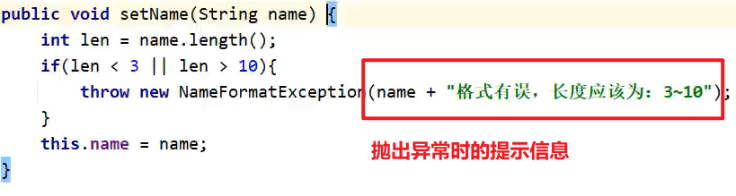

# 继承

把共性内容抽取到父类当中，提高代码的复用性

### 子类调用父类方法可以，除了构造方法

Dog可以调用Animal的构造方法，但是getset方法就不用重新写了，直接用就可以了（因为继承下来了）

### 父类的私有变量不可被子类使用，但是用getset操作还是可以的

### 继承中构造方法的访问特点

* 子类不能继承父类的构造方法，但是可以通过super调用
* 子类构造方法的第一行，有一个默认的super()；
* 默认先访问父类中无参的构造方法，再执行自己。
* 如果想要方法文父类有参构造，必须手动书写。


### this、super使用总结

* this:理解为一个变量，表示当前方法调用者的地址值
* super:代表父类存储空间

### 用this访问本类的其他构造

==用于给一些数据做默认值的时候用到==

在子类的构造方法中，只要有一个去访问父类就可以了（在其他构造当中默认第一行都是有一个隐藏的super()的）


### 一个标准的Javabean类要包含：

1．类名见名知意
2．所有的成员变量都需要私有
3．构造方法（空参带全部参数的构造）
4.get/set

==（好像里面的方法都不用static？）==

==toString也是在Javabean类里面重写的==

### 带全部参数的构造是要父类加子类全都包含的

传递给父类的构造方法进行赋值

自己特有的在本类里面赋值

```java
//空参构造
publicManager(){
}
//带全部参数的构造
//父类 + 子类
public Manager(String id,String name,doublesalary,doublebouns){
	super(id,name,salary);
	this.bouns = bouns;
}
```

 父类变量有getset，子类就不用再写了，子类把自己独有的补上就行了

# 多态

## 理解

借用内部类的方式理解

【黑马程序员Java零基础视频教程_上部(2022新版Java入门，含斯坦福大学练习题+力扣算法题+大厂java面试题）】 【精准空降到 09:37】 https://www.bilibili.com/video/BV17F411T7Ao?p=141&share_source=copy_web&vd_source=a509fb44c892c9c55cbccbacad6d249b&t=577

## 多态的优势

### 在多态形式下，右边对象可以实现解耦合，便于扩展和维护。

```java
Person p= new Student();
p.work();//业务逻辑发生改变时，后续代码无需修改
```

### 定义方法的时候，使用父类型作为参数，可以接收所有子类对象，体现多态的扩展性与便利。
## 多态的弊端

### 不能调用子类的特有功能

原因是当调用成员方法时，首先是看父类中是否包含该方法，然后再调用子类重写的方法，如果父类没有，会直接报错

### 解决手段

变回==原来的==子类类型

### 问题又来了，我不知道上面的代码写了它是啥类型的咋办

可以用instanceof来判断,它返回的是布尔类型的值 

```java
if(a instanceof Dog){
    Dog d = (Dog) a;
    d.lookhome;
}else if(a instanceof Cat){
    Cat c = (Cat) a;
    c.catchMouse;
}
```

JDK14新特性


Person类


Application类


# 权限修饰符的使用规则
## 实际开发中，一般只用private和public

* 成员变量私有
* 方法公开
* 特例：如果方法中的代码是抽取其他方法中共性代码，这个共性的代码你又不想让外界去使用，这个方法一般也私有。

# 代码块

## 局部代码块（已淘汰）

在方法里面的代码块，优先运行，碰到代码块的右括号就结束生命

优势是节省内存空间（因为用完就丢），但现在内存技术发达，所以不怎么用

## 构造代码块（不够灵活）

每创建一个对象就执行一次

下图代码块在Application类执行Student student = new Student();时执行

但是不够灵活，每次构造时都是强制执行


### 在多个构造方法里有重复代码下的替代方案

1. 把重复代码写在一个构造方法当中，在其他的构造方法中就不用再写了，可以通过this关键字调用本类的其他构造，不知道的值(name和age)给个默认值就行了
2. 把重复代码抽取成一个方法，想用的时候调方法就可以了


## 静态代码块（重点）

格式：static{}
特点：需要通过static关键字修饰，随着类的加载而加载，并且自动触发、==只执行一次==
==使用场景：在类加载的时候，做一些数据初始化的时候使用。==

### 可以用来在学生管理系统提前添加一个用户信息，使用时就可以直接登录使用了（免去注册环节）


因为静态里面只能用静态，所以集合也要用static修饰

### 但好像不用静态代码块也可以进行数据初始化？


==只要是方法，就有可能被别人反复地去调用，此时这样的集合可能在内存中有多个，而且有可能会在循环中被反复的添加==

main方法其实也是可以被我们手动调用的（以上图为例）

```java
App2.main(null);
```

# 抽象类（未看完全视频）

## 抽象类和抽象方法的注意事项

* 抽象类不能实例化
* 抽象类中不一定有抽象方法，有抽象方法的类一定是抽象类
* 可以有构造方法
* 抽象类的子类
  * 要么重写抽象类中的所有抽象方法
  * 要么是抽象类

# 接口

## 存在意义

### 有少部分子类不需要这个功能

假设有个Animal父类，我们抽取的共性方法有吃饭，喝水和游泳，它的子类有兔子，青蛙和狗。但有个问题：

==兔子不会游泳啊！==

### 用统一规范 书写各自实现的方法 的格式

我们要实现的方法是游泳，但是A老哥觉得方法起名叫swim好，B老哥觉得起名叫swimming更恰当

==但是如果使用接口，那他们就要用接口定义的规则来书写==

### 需要一个对象来干活，但对象间是什么关系无所谓

public void 搬家(运输的接口 c)

* 搬家(车的对象)
* 搬家(搬家公司)

==是不是继承关系无所谓，反正这活得有东西干== 

### 接囗就是一种规则,是对行为的抽象

**接口的定义和使用**

* 接口用关键字interface来定义
  public interface 接口名{}

* 接口不能实例化

* 接口和类之间是实现关系，通过implements关键字表示
  public class 类名 implements 接口名{}

* 接口的子类（实现类）
  要么重写接口中的所有抽象方法
  要么是抽象类

  

注意1：接口和类的实现关系，可以单实现，也可以多实现。
	public class 类名 implements 接口名1, 接口名2{}

注意2：实现类还可以在继承一个类的同时实现多个接口。
	public class 类名 extends 父类 implements 接口名1, 接口名2{}

## 接口中成员特点

==默认：你不写Java也会帮你加上==

* 成员变量

  ​	规则不可变，所以成员变量只能是常量

  ​	==默认修饰符==：public(这个就不用说了) static(静态方便调用) final

* 构造方法：==没有==

  ​	接口不能创建对象，接口当中也不需要给子类的成员变量赋值，所以用不着构造方法

* 成员方法

  ​	只能是抽象方法
  ​	==默认修饰符==：public abstract

* JDK7以前：接口中只能定义抽象方法。
* JDK8的新特性：接口中可以定义有方法体的方法
* JDK9的新特性：接口中可以定义私有方法。

## 接口和类之间的关系
* 类和类的关系
  继承关系，只能单继承，不能多继承，但是可以多层继承

* 类和接口的关系
  实现关系，可以单实现，也可以多实现，还可以在继承一个类的同时实现多个接口

  ==多个接口的重名方法实现：重写一个就行了==

* 接口和接口的关系
  继承关系，可以单继承，也可以多继承

  ==如果实现类实现了最下面的子接口，那么就需要重写所有的抽象方法==

# 接口和抽象类练习

继承：子类是父类中的一种
隐含的味道：
一个父类中所有的子类需要是同一种事物


# 有关接口的其他知识

### JDK7以前，接口中只能定义抽象方法。

## 接口中新增方法

### JDK8以后接口中可以定义有方法体的方法。
（默认、静态）

* 允许在接口中定义默认方法，需要使用关键字default修饰
  作用：解决接口升级的问题

  

接口中默认方法的定义格式：

* 格式，public default 返回值类型 方法名（参数列表）{}
* 范例：public default void show(){}

接口中默认方法的注意事项：

* 默认方法不是抽象方法，所以不强制被重写。但是如果被重写，重写的时候去掉default关键字
* ==public可以省略，default不能省略==
* 如果实现了多个接口，多个接口中存在相同名字的默认方法，子类就必须对该方法进行重写

### JDK9以后接口中可以定义私有方法（普通用、静态用）

接口中私有方法的定义格式：

**普通的私有方法，给默认方法服务的**

* 格式1：private 返回值类型 方法名(参数列表){}
  范例1：private void show(){}

**静态的私有方法，给静态方法服务的**

* 格式2，private static返回值类型方法名(参数列表){}
  范例2，private static void method(){}

**以这种形式，我们就可以把某些重复代码提取成一个方法，给其他要用到这些重复代码的方法去调用，同时不让外界去调用这些重复代码（好比长长的日志文件）**

## 适配器设计模式

1．当一个接口中抽象方法过多，但是我只要使用其中一部分的时候，就可以适配器设计模式
2，书写步骤：
编写中间类XXXAdapter,实现对应的接口
对接口中的抽象方法进行空实现
让真正的实现类继承中间类，并重写需要用的方法
为了避免其他类创建适配器类的对象，中间的适配器类用abstract进行修饰

### 示例

假如我现在有一个接口，我只想用它的第五个方法

```java
public interface Inter {
    public abstract void method1();
    public abstract void method2();
    public abstract void method3();
    public abstract void method4();
    public abstract void method5();
}
```

但是这样直接实现的话我们被迫要重写五次方法

所以要用到适配器设计模式：在接口和想要实现的类中间新建一个类实现接口

==用abstract不让外界创建它的对象==

```java
public abstract class InterAdapter implements Inter{
    @Override
    public void method1() {
        
    }
    
    @Override
    public void method2() {
        
    }
    
    @Override
    public void method3() {
        
    }
    
    @Override
    public void method4() {
        
    }
    
    @Override
    public void method5() {
        
    }
}
```

==但只是空实现==

然后让实现类改为继承这个接口

```java
public class InterImpl extends InterAdapter{
    @Override
    public void method5() {
        sout.....
    }
}
```

==我要用到哪个方法，就重写哪个方法就可以了==

# 内部类

### 类的五大成员：
属性、方法、构造方法、代码块、内部类

### 内部类的访问特点
内部类可以直接访问外部类的成员，包括私有
外部类要访问内部类的成员，必须创建对象

### 以ArrayList中的迭代器引出对内部类的理解

汽车和引擎是相对独立的（汽车牌子，汽车性能，引擎牌子，引擎性能），但引擎又属于汽车的一部分（不能单独出现），所以我们要在汽车这个类里面建一个引擎这个内部类

## 成员内部类（知道怎么写就行）

* 写在成员位置的，属于外部类的成员：和属性（也就是成员变量）并列写在一起
* 也因此，修饰成员变量的，也可以拿来修饰成员内部类，比如：private,默认,protected,public等（static的叫静态内部类）
* 用法相当于一个成员变量
* 在成员内部类里面，JDK16之前不能定义静态变量，JDK16开始才可以定义静态变量。

### 获取成员内部类对象
方式一：内部类是private时 -> 在外部类中编写方法，对外提供内部类的对象。

```java
public class Outer {
    public Inner getInstance(){
        return new Inner();
    }
}
```

```java
public class Application{
    Outer o = new Outer();
    o.getInstance;
}
```


方式二：内部类不是private时 -> 直接创建格式：外部类名.内部类名 对象名=外部类对象.内部类对象；

> 【黑马程序员Java零基础视频教程_上部(2022新版Java入门，含斯坦福大学练习题+力扣算法题+大厂java面试题）】 【精准空降到 09:37】 https://www.bilibili.com/video/BV17F411T7Ao?p=141&share_source=copy_web&vd_source=a509fb44c892c9c55cbccbacad6d249b&t=577

### 调用变量（易错！）

==人不是心脏的爹，所以心脏想调用人的参数不能用super！==


## 静态内部类（能看懂就行）

### 说明

静态内部类只能访问外部类中的静态变量和静态方法，如果想要访问非静态的需要创建对象。

### 创建静态内部类对象的格式

外部类名.内部类名 对象名 = new 外部类名.内部类名()；

### 调用非静态方法的格式

先创建对象，用对象调用
### 调用静态方法的格式

外部类名.内部类名.方法名()；

==与上面局部内部类不同的是，我们调用的是静态内部类Inner，其中show1是Inner中的非静态方法，show2是Inner中的静态方法==


### 概括总结

如何调用静态内部类中的方法？

* 非静态方法：先创建对象，用对象调用
* 静态方法：外部类名.内部类名，方法名()；

## 局部内部类（能看懂就行，没啥用）

局部内部类

1. 将内部类定义在方法里面就叫做局部内部类,==类似于方法里面的局部变量==。==（和局部变量同等地位哈）==
2. 外界无法直接使用，需要在方法内部创建对象并使用。
3. 该类可以直接访问外部类的成员，也可以访问方法内的局部变量。

## 匿名内部类（重点掌握）

匿名内部类本质上就是隐藏了名字的内部类,==用于替代那些只会用一次的类==

对于==一个接口的匿名内部类==，一共要包含三个部分

> 继承或实现，方法重写，创建对象。

==它的整体就是一个类的子类对象或者接口的实现类对象！==

### 示例

现在我们有一个接口

```java
public interface Swim {
    public abstract void swim();
}
```

然后我们来整个匿名内部类把接口实现下

```java
public static void main（String[] args）{
    /*
    new 类名或接口名(){
    重写方法;
    };
    */
    new Swim(){
        //Swim()后面的是一个匿名内部类，通过new Swim()来创建它的对象
        @Override
        public void swim(){
            System.out.println("重写了游泳的方法")
        }
    };
}
```

格式和new 类名();是差不多的，所以别把分号忘了

==而一个抽象类与它的匿名内部类则是继承关系==

```java
new Animal(){
    @Override
    public void eat(){
    	System.out.println("重写了eat的方法")
    }
};
```

### 使用场景
**当方法的参数是接口或者类时，
以接口为例，可以传递这个接口的实现类对象，
如果实现类只要使用一次，就可以用匿名内部类简化代码**

```java
	method(
		new Animal() {
        	@Override
        	public void eat() {
            	sout.......
        	}
    	}//传的参数不用带分号
	);//方法后面要有分号

public static void method(Animal a){
    //Animal a是子类对象，所以这里用了多态
    a.eat();
}
```


```java
//也可以赋值给一个swim类型的变量
Swim s = new Swim(){
	@Override
	public void swim(){
		System.out.println("重写了游泳的方法")
	}
};
```

# 阶段项目：拼图游戏

## 精简main

### 用extends替换Application中的高代码量类

按照以往的方式（学生管理系统），我们是在main里面调用登录方法什么的然后在下面写登录方法

==但现在，我们是要new一个JFrame作登录页面,并且里面包含的业务逻辑还挺多的==

那有没有更好的解决方法？

有，==extends==

> //LoginJFrame表示登录界面
> //以后所有跟登录相关的代码，都写在这里

```java
public class LoginJFrame extends JFrame {
    //获取用户输入的用户名
	//获取用户输入的密码
	//生成一个验证码
	//获取用户输入的验证码
	//比较用户．密码，验证码
	//300多行
}
```

然后main里面,==如果我们想要开启一个界面，就创建谁的对象就可以了==

```java
public static void main(String[] args){
    new LoginJFrame();
}
```

### new时候的初始化

这个时候，我们登陆界面的设置要在new的时候完成，所以我们要在无参构造方法中设置

==this表示当前创建的这个对象的地址值==

```java
public class LoginJFrame extends JFrame{
    public LoginJFrame(){
        //在创建登录界面的时候，同时给这个界面去设置一些信息
		//比如把宽、高直接展示出来
        this.setSize(488,430);
		this.setVisibie(true);
    }
}
```


==写到最后：指程序最后==

## 菜单制作

### 1. 先创建JMenuBar -> 菜单长条

```java
JMenuBar jMenuBar = new JMenuBar();
```

### 2. 再创建Jmenu -> 功能位


### 3. 再创建JMenuItem -> 拓展栏


### 4. 把JMenuItem放到Jmenu里面


### 5. 把JMenu放到JMenuBar里面


### 6. 最后再把JMenuBar添加到整个Jframe界面中


## 抽取方法：ctrl + alt + m

==init：初始化==


然后把上面“菜单制作”的全部内容（不包含this.setVisible）同样操作


## 添加图片

### 取消默认居中


### 选择模块名，然后ctrl+ v

==同样也是抽取方法==


### 使用循环改进


### 循环中定位图片名称

在外层循环写上int number = i;

在内层循环写上number++；


因为我们只有15张图，所以找不到第16张图的时候它就加载了一个空白

## 打乱图片

### ramdom中的nextInt方法：闭区间

可以直接用r.nextInt(tempArr.length);

### 按顺序添加到位置

**解法一：适用于行列相等的二维数组**


==注意：int的除法指保留整数，所以15/3=3==

**解法二：适用于行列不相等的二维数组**


## TODO：阶段项目5及以后

# 常用API

## Math


## System


拷贝过去的数组好像是直接覆盖对应位置而不是像StringBuilder的insert一样


赋给父类类型的子类类型，在要获取的时候，得强转才行

## Rumtime


## Object


clone的用途：游戏数据转区

直接实现就行，这接口是Java自带的

clone在lang包下是protected的，所以我们要把他给重写了，顺便调用父类的方法把东西返回回去


浅克隆：不管对象内部的属性是基本数据类型还是引用数据类型，都完全拷贝过来

深克隆：基本数据类型拷贝过来，字符串复用，引用数据类型会重新创建新的

Object中的克隆是浅克隆，只复制地址值

所以咱重写个深克隆


==以后对象的克隆：导jar包：gson-2.6.2.jar==


```java
boolean result = Objects.equals(s1, s2);
System.out.println(result);
```

细节：

1. 方法的底层会判断sl是否为null，如果为null，直接返回false
2. 如果s1不为null，那么就利用sl再次调用equals方法

3. 此时s1是Student类型，所以最终还是会调用Student中的equals方法。
   如果没有重写，比较地址值，如果重写了，就比较属性值。

## BigInteger

【黑马程序员Java零基础视频教程_上部(2022新版Java入门，含斯坦福大学练习题+力扣算法题+大厂java面试题）】 https://www.bilibili.com/video/BV17F411T7Ao?p=161&share_source=copy_web&vd_source=a509fb44c892c9c55cbccbacad6d249b


第七点想返回long类型的话


## BigDecima（没看）

## 正则表达式

### 应用场景

1. 正则表达式可以校验字符串是否满足一定的规则，并用来校验数据格式的合法性
2. 在一段文本中查找满足要求的内容

### 示例

* 需求：假如现在要求校验一个qq号码是否正确

* 规则：6位及20位之内，0不能在开头，必须全部是数字
       先使用目前所学知识完成校验需求
       然后体验一下正则表达式检验

* 发现如果用已学知识来做的话

  * 进行if嵌套
  * ==布尔逐步校验return false（好用！但是代码量大）==

  * 核心思想是：先把异常数据进行过滤，下面的就是满足要求的数据了。

* 用正则表达式

  ```java
  System.out.println(qq.matches("[1-9]\\d{5,19}"));
  ```

### 规则


**字符类**


上面这行，&匹配上了，所以也对了

* System.out.println("b".matches("[a-z&&[def]]"));//相当于：是不是def

* System.out.println("0".matches("[a-z&&[ ^m-p]]"));相当于：a-z间除了m-p之外的范围

**预定义字符**

* \ 转义字符

  > 改变后面那个字符原本的含义
	>
	> 比如System.out.println("\\"");
	
* \\\\:前面的\是一个转义字符，改变了后面\原本的含义，把他变成一个普普通通的\而己。


> 两个.表示两个字符是啥都行


### 编写思路

拿着一个正确的数据，从左到右依次去写

**验证手机号码 **

* 1    只能1开头
* [3-9]    手机号码第二位只能3-9之间的
* \\\\d{9}    剩下数字只能出现9次，什么素质都行

```java
String regex1 = "1[3-9]\\d{9}";
System.out.println("15360598699".matches(regex1));
```

**验证座机号码**

1. 区号    0\\\\d{2,3}    0开头，后面加上2-3位任意数字
2. \-    ?表示可以出现0到1次
3. 号码    号码的第一位也不能以0开头，从第二位开始可以是任意的数字，号码的总长度：5-10位

```java
String regex2 = "0\\d{2,3}-?[1-9]\\d{4,9}";
```

**验证邮箱号码**


### 高效使用any-rule

==在实际开发中，很少会自己写正则表达式。一般会百度一个类似的，自己改成公司要求的。==

先写一个：

```java
String regex = "";
```

鼠标点俩引号中间，然后点anyrule，把自动去除首尾斜杠勾了

我们先搜个 “ 时间 ”

```java
String regex = "^(?:1[0-2]|0?[1-9]):[0-5]\d:[0-5]\d$";
```

再把首尾的^和$去掉

```java
String regex = "(?:1[0-2]|0?[1-9]):[0-5]\d:[0-5]\d";
```

每个\后面再加一个\

```java
String regex = "(?:1[0-2]|0?[1-9]):[0-5]\\d:[0-5]\\d";
```

?:删掉

```java
String regex = "(1[0-2]|0?[1-9]):[0-5]\\d:[0-5]\\d";
```

### 最后一篇没看

【黑马程序员Java零基础视频教程_上部(2022新版Java入门，含斯坦福大学练习题+力扣算法题+大厂java面试题）】 https://www.bilibili.com/video/BV17F411T7Ao?p=165&share_source=copy_web&vd_source=a509fb44c892c9c55cbccbacad6d249b

## 爬虫（当然了，没python好用）


然后把所有代码抽取成一个方法，ctrl+alt+m


当find返回false，循环停止  

### 后面部分没看完

【黑马程序员Java零基础视频教程_上部(2022新版Java入门，含斯坦福大学练习题+力扣算法题+大厂java面试题）】 【精准空降到 13:33】 https://www.bilibili.com/video/BV17F411T7Ao?p=166&share_source=copy_web&vd_source=a509fb44c892c9c55cbccbacad6d249b&t=813

## 包装类

### ====表示比较地址值是否相等==


### next()与nextLine

[关于nextInt()、next()和nextLine()的用法_小霸王学习机_001的博客-CSDN博客_nextint怎么用](https://blog.csdn.net/weixin_45156514/article/details/123553442)

[sc.next() 和 sc.nextLine 的区别_csdn_9527666的博客-CSDN博客_sc.nextline](https://blog.csdn.net/csdn_9527666/article/details/77917047)

==next()碰到分隔符结束==

==nextInt()等碰到回车\n或空格就结束*,只读取回车前输入的对应类型数值==

==nextLine碰到回车结束==

==所以在next()和NextInt()等方法后面用nextLine()时，要先拿个nextLine()吃掉前面剩的回车或空格==

==nextLine()除了回车啥都能读取,也就是碰到回车时结束读取,但不会把回车留在缓冲区==

所以


==以后不管什么样的数据，统一nextLine()，先把数据录入内存当中，以后想要什么转换就完事了==

## 综合练习

>  键盘录入一些1-100之间的整数，并添加到集合中，直到集合中所有数据和超过200为止。


# 常见算法

## 查找

==返回多个数据时，我们可以把这些数据添加到数组或集合中==

**都要先排序**

### 二分查找


### 插值查找

**优点**：算mid更快

**缺点**：要求数组数据分布要比较均匀


### 斐波那契查找

mid不在中间了，改成0.618

### 分块查找

==这个算法直接这样用的场景非常少，主要是分块的这种思想在很多地方有用==

**分块原则：**

* 前一块中的最大数据，小于后一块中所有的数据（块内无序，块间有序）

* 块数数量一般等于数字的个数开根号。比如：16个数字一般分为4块左右

> 7 10 | 13 19 16 20 | 27 22 30 40 36 | 43 50 48

**先确定要查找的元素在哪一块，然后在块内挨个查找**


==后面块内元素大小必须比前面块内的大==


给Block类来个快速生成

### 扩展的分块查找 -> 哈希查找（对无规律的数据）

==每一块数据范围不能有交集==


一些变更


## 排序

### 冒泡排序


### 选择排序

1. 从0索引开始，跟后面的元素一一比较
2. 小的放前面，大的放后面
3. 第一轮循环结束后，最小的数据已经确定
4. 第二轮循环从1索引开始，以此类推
5. 第三轮循环从2索引开始，以此类推
6. 第四轮循环从3索引开始，以此类推

## 递归


练习：[常见算法-05-快速排序_哔哩哔哩_bilibili](https://www.bilibili.com/video/BV17F411T7Ao/?p=181&vd_source=5322c4cb2cc6b441eeb5b161fd4f2ce6)

# Arrays

 

 ## 降序排序

### 通过重写方法实现

==只能给引用数据类型的数组进行排序，如果数组是基本数据类型的，需要变成其对于的包装类==

```java
public static void sort(数组, 排序规则)//按照指定的规则排序
```

* 参数一：要排序的数组
* 参数二：排序的规则

**第二个参数是一个接口，所以我们在调用方法的时候，需要传递这个接口的实现类对象，作为排序的规则
但是这个实现类，我只要使用一次，所以就没有必要单独的去写一个类，直接采取匿名内部类的方式就可以了**


直接回车就能触发重写 

new的不是接口，而是后面这个没有名字的这个类的对象

### 底层原理：
* 利用插入排序+二分查找的方式进行排序的。
* 默认把0索引的数据当做是有序的序列，1索引到最后认为是无序的序列。
* 遍历无序的序列得到里面的每一个元素，假设当前遍历得到的元素是A元素
* 把A往有序序列中进行插入，在插入的时候，是利用二分查找确定A元素的插入点。
* 拿着A元素，跟插入点的元素进行比较，比较的规则就是c。mpare方法的方法体
* 如果方法的返回值是负数，拿着A继续跟前面的数据进行比较
* 如果方法的返回值是正数，拿着A继续跟后面的数据进行比较
* 如果方法的返回值是0，也拿着A跟后面的数据进行比较
* 直到能确定A的最终位置为止。

### compare方法的形式参数：
* 参数一 o1：表示在无序序列中，遍历得到的每一个元素
* 参数二 o2：有序序列中的元素

### 返回值

* 负数：表示当前要插入的元素是小的，放在前面

* 正数：表示当前要插入的元素是大的，放在后面

* 0：表示当前要插入的元素跟现在的元素比是一样的，也会放在后面

### 简单理解：
* o1-o2：升序排列
* o2-o1：降序排列

```java
Arrays.sort(arr, new Comparator<Integer>() {
    @Override
    public int compare(Integer o1, Integer o2) {
        return o1-o2;
    }
});//什么阴间语法
```

# Lambda表达式

## 函数式编程

==函数式编程思想，忽略面向对象的复杂语法，强调做什么，而不是谁去做==

Lambda表达式就是函数式思想的体现

* ()对应着方法的形参
* ->固定格式
* {}对应着方法的方法体


## 注意点

* Lambda表达式可以用来简化匿名内部类的书写
* Lambda表达式只能简化函数式接口的匿名内部类的写法
* 函数式接囗：
  * 有且仅有一个抽象方法的接口叫做函数式接口，接口上方可以用@FunctionalInterface注解


## 总结

1. Lambda表达式的基本作用？
   简化函数式接口的匿名内部类的写法。
2. Lambda表达式有什么使用前提？
   必须是接口的匿名内部类，接口中只能有一个抽象方法
3. Lambda的好处？
   Lambda是一个匿名函数，我们可以把Lambda表达式理解为是一段可以传递的代码，它可以写出更简洁、更灵活的代码，作为一种更紧凑的代码风格，侧ava语言表达能力得到了提升。

## 省略规则

1. 参数类型可以省略不写。
2. 如果只有一个参数，参数类型可以省略，同时0也可以省略：
   3·如果Lambda表达式的方法体只有一行，大括号，分号，return可以省略不写，需要同时省略。

# 单列集合Collection：一次只添加一个数据


==注意：我们不能往集合里面扔基本类型，但可以扔引用类型，这意味着我们虽然不能把int扔集合里，但能扔int[]进去==

## 删除：

* 因为collection里面定义的是共性的方法，所以此时不能通过索引进行删除。只能通过元素的对象进行删除。
* 方法会有一个布尔类型的返回值，删除成功返回true，删除失败返回false

## 包含：

* 底层是依赖equals方法进行判断是否存在的
* 所以，如果集合中存储的是自定义对象，没有重写equals方法，那么默认使用Object类中的equals方法进行判断，而Object类中equals方法，依赖地址值进行判断。
* ==重写equals让他来比较属性值==
  * alt + insert，选equals&hashCode，一路next，把后面重写的hashCode删掉

## 单列集合Collection通用遍历方式

### 在遍历的过程中需要删除元素，请使用迭代器

### 迭代器遍历：不依赖索引

* 报错NoSuchElementException
* 迭代器遍历完毕，指针不会复位，想要重来只能再去获取一个迭代器的对象
* 循环中只能用一次next方法
* 迭代器==遍历时==，不能用集合的方法进行增加或者删除，如果实在要删除吗，那么可以用迭代器提供的remove方法进行删除

* remove()：从迭代指向的collection中移除迭代返回的最后一个元素

  ```java
  while(it.hasNext()){
      String str = it.next();
      if("bbb".equals(str)){
          it.remove();
      }
  }
  ```

  


### 仅仅想遍历，那么使用增强for或Lambda表达式。

### 增强for遍历

==快速生成：集合的名字.for，回车==

* 增强for的底层就是迭代器，为了简化迭代器的代码书写的。
* 它是JDK5之后出现的，其内部原理就是一个Iterator迭代器
* 所有的单列集合和数组才能用增强for进行遍历。
* ==注意！其中的s是个第三方变量！它只负责记录，所以修改增强for中的变量不会改变集合中原本的数据。==

### Lambda表达式遍历

先以匿名内部类的方式理解一下


真正的lambda遍历

```java
list.forEach(s -> System.out.println(s));
```

### 五种遍历方式对比

* 在遍历的过程中需要删除元素，请使用**迭代器**
* 在遍历的过程中需要添加元素，请使用**列表迭代器**
* 仅仅想遍历，那么使用**增强for**或**Lambda表达式**
* 如果遍历的时候想操作索引，可以用**普通for**

## List

### List系列集合添加的元素：

* 有序：存和取的顺序是一样的
* 可重复：存储的元素可以重复
* 有索引：可以通过索引操作元索
* 如果我们要往List系列集合中添加数据，那么方法永远返回true，因为List系列的是允许元素重复的。

### List集合的特有方法

* Collection的方法List都继承了
* List集合因为有索引，所以多了很多索引操作的方法。


* add：在此集合中的指定位置==插入==指定的元素，==原来索引上的元素会依次往后移==

* remove：想删除数字1就要先把1装箱，不然就是删索引

  因为在调用方法的时候，如果方法出现了重载现象，会优先调用实参跟形参类型一致的那个方法

  解决办法：

### 列表迭代器遍历


这样qqq就加到bbb后面了

### 普通for循环


### ArrayList底层集合原理（未看完）

* 利用空参创建的集合，在底层创建一个默认长度为0的数组

* 添加第一个元素时，底层会创建一个新的长度为10的数组

* size同时表示了：

  * 元素个数（因为每存入一个元素size针就会右移一位）
  * 下次存入位置

* 存满时，会扩容1.5倍

* 如果一次添加多个元素，1.5倍还放不下，则新创建数组的长度以实际为准

  > 原来有10个，现在我要新增100个，那新数组长度110

https://www.bilibili.com/video/BV17F411T7Ao/?p=190&spm_id_from=pageDriver&vd_source=5322c4cb2cc6b441eeb5b161fd4f2ce6

### LinkedList集合：双链表

* 底层数据结构是双链表，查询慢，首尾操作的速度是极快的，所以多了很多首尾操作的特有API


## Set

### Set系列集合添加的元素：

* 无序：存取顺序不一致
* 不重复：可用于去重
* 无索引：没有带索引的方法，所以不能使用普通for循环遍历，也不能通过索引来获取元素
* 如果我们要往set系列集合中添加数据，如果当前要添加的元素不存在，方法返回true,表示添加成功；如果当前要添加的元素己经存在，方法返回false，表示添加失败。因为set系列的集合不允许重复。

# 数据结构 · List下的实现类

==不同的业务场景要选择不同的数据结构==

* 每种数据结构长什么样子？
* 如何添加数据？
* 如何删除数据？

## 栈：后进先出，先进后出


在栈内存内,最先调用的方法(main)最后结束

## 队列：先进先出，后进后出


## 数组

* **查询速度快**：查询数据通过地址值和索引定位，查询任意数据耗时相同（元素在内存中是连续存储的）
* **删除效率低**：要将原始数据删除，同时后面每个数据前移
* **添加效率极低**：添加位置后的每个数据后移，再添加元素

## 链表

* 链表中的结点是独立的对象，在内存中是不连续的，每个结点包含数据值和下一个结点的地址
* 链表查询慢，无论查询哪个数据都要从头开始找

* 增删相对较快


# 双列集合：一次添加一对数据


# 泛型

## 好处

* 统一数据类型
* 把运行时期的问题提前到了编译期间，避免了强制类型转换可能出现的异常，因为在编译阶段类型就能确定下来。

## 细节

* 泛型中不能写基本数据类型

  > ==注意：我们不能往集合里面扔基本类型，但可以扔引用类型，这意味着我们虽然不能把int扔集合里，但能扔int[]进去==

* 指定泛型的具体类型后，传递数据时，可以传入该类型和他的子类类型

* 如果不写泛型，类型默认是Object

* 泛型不具备继承性，但是数据具备继承性
  * 只能传Animal
  * 可以，随便传

## 在哪定义

* 泛型类：在类名后面定义泛型/创建该类对象的时候，确定类型
* 泛型方法：在修饰符后面定义方法，调用该方法的时候，确定类型
* 泛型接口：在接口名后面定义泛型，实现类确定类型，实现类延续泛型

## 使用场景

* 定义类、方法、接口的时候，如果类型不确定，就可以定义泛型
* 如果类型不确定，但是能知道是哪个继承体系中的，可以使用泛型的通配符

## 泛型类


## 泛型方法：方法被调用时，类型就确定下来了


右边私有化构造方法不让外界创建他的对象

## 泛型接口


## 通配符


爷或者是爷的子类


## 综合练习

name和age不确定的情况下


# 数据结构


# Set

## Set集合的实现类

HashSet：无序、不重复、无索引
LinkedHashSet:**有序**、不重复、无索引
TreeSet:**可排序**、不重复、无索引

**Set接囗中的方法上基本上与Collection的API一致**

## 遍历


## HashSet

### 哈希值

* 根据hashCode方法算出来的int类型的整数
* 该方法定义在Object类中，所有对象都可以调用，默认使用地址值进行计算
* **一般情况下，会重写hashCode方法，利用对象内部的属性值计算哈希值**

### 对象的哈希值特点

* 如果没有重写hashCode方法，不同对象计算出的哈希值是不同的
* 如果已经重写hashcode方法，不同的对象只要属性值相同，计算出的哈希值就是一样的

* 在小部分情况下，不同的属性值或者不同的地址值计算出来的哈希值也有可能一样（哈希碰撞）


然后我们在Student类重写hashCode


**1.8之前是数组+链表，1.8及以后是数组+链表+红黑树**

==如果集合中存储的是自定义对象，必须要重写hashCode和equals方法==

==HashCode确定存入位置，equals确定是否存入==


==Java提供的类比如String和Integer都是重写hashCode了的==

## LinkedHashSet

* 有序指的是保证存储和取出的元素顺序一致

* 底层数据结构是依然哈希表，只是每个元素又额外的多了一个双链表的机制记录存储的顺序。


### 总结

1. LinkedHashSet集合的特点和原理是怎么样的？
   * 有序、不重复、无索引
   * 底层基于哈希表，使用双链表记录添加顺序
2. 在以后如果要数据去重，我们使用哪个？
   * ==默认使用HashSet==
   * 如果要求去重且存取有序，才使用LinkedHashSet

## TreeSet

### TreeSet的特点

* 不重复、无索引、可排序
* 可排序：按照元素的默认规则（有小到大）排序。
* TreeSet集合底层是基于==红黑树的数据结构==实现排序的，增删改查性能都较好。

### TreeSet对象排序练习题

* 需求：创建5个学生对象
* 属性：（姓名，年龄，语文成绩，数学成绩，英语成绩),
* 按照总分从高到低输出到控制台
* 如果总分一样，按照语文成绩排
* 如果语文一样，按照数学成绩排
* 如果数学成绩一样，按照英语成绩排
* 如果英文成绩一样，按照年龄排
* 如果年龄一样，按照姓名的字母顺序排
* 如果都一样，认为是同一个学生，不存。

**方式一：Javabean类实现Comparable接口，指定比较规则**

Application类

```java
package 黑马.TreeSet练习;

import java.util.TreeSet;

public class Application {
    public static void main(String[] args) {
        Student s1 = new Student("zhangsan",23,90,99,50);
        Student s2 = new Student("lisi",24,90,98,50);
        Student s3 = new Student("wangwu",25,95,100,30);
        Student s4 = new Student("zhaoliu",26,60,99,70);
        Student s5 = new Student("qianqi",26,70,80,70);

        TreeSet<Student> treeSet = new TreeSet<>();

        treeSet.add(s1);
        treeSet.add(s2);
        treeSet.add(s3);
        treeSet.add(s4);
        treeSet.add(s5);

        for (Student student : treeSet) {
            System.out.println(student);
        }
    }
}
```

Student类

```java
package 黑马.TreeSet练习;

public class Student implements Comparable<Student> {
    private String name;
    private int age;
    private int chineseScore;
    private int mathScore;
    private int englishScore;

    public String getName() {
        return name;
    }

    public void setName(String name) {
        this.name = name;
    }

    public int getAge() {
        return age;
    }

    public void setAge(int age) {
        this.age = age;
    }

    public int getChineseScore() {
        return chineseScore;
    }

    public void setChineseScore(int chineseScore) {
        this.chineseScore = chineseScore;
    }

    public int getMathScore() {
        return mathScore;
    }

    public void setMathScore(int mathScore) {
        this.mathScore = mathScore;
    }

    public int getEnglishScore() {
        return englishScore;
    }

    public void setEnglishScore(int englishScore) {
        this.englishScore = englishScore;
    }

    public Student(String name, int age, int chineseScore, int mathScore, int englishScore) {
        this.name = name;
        this.age = age;
        this.chineseScore = chineseScore;
        this.mathScore = mathScore;
        this.englishScore = englishScore;
    }

    public Student() {
    }

    @Override
    public String toString() {
        return "Student{" +
                "name='" + name + '\'' +
                ", age=" + age +
                ", chineseScore=" + chineseScore +
                ", mathScore=" + mathScore +
                ", englishScore=" + englishScore +
                '}';
    }

    @Override
    public int compareTo(Student o) {
        int sum1 = this.chineseScore + this.getMathScore() + this.englishScore;
        int sum2 = o.chineseScore + o.getMathScore() + o.englishScore;
        int i = sum1 - sum2;
        i = i == 0 ? this.chineseScore - o.chineseScore : i;
        i = i == 0 ? this.mathScore - o.mathScore : i;
        i = i == 0 ? this.englishScore - o.englishScore : i;
        i = i == 0 ? this.age - o.age : i;
        i = i == 0 ? this.name.compareTo(o.name) : i;
        return i;//如果想要倒序，可以return -i;
    }
}
```

==如果想要倒序，可以return -i==

**方式二：创建集合时，自定义Comparator比较器对象，指定比较规则**

Application类

```java
package 黑马.TreeSet练习;

import java.util.Comparator;
import java.util.TreeSet;

public class Application {
    public static void main(String[] args) {
        Student s1 = new Student("zhangsan", 23, 90, 99, 50);
        Student s2 = new Student("lisi", 24, 90, 98, 50);
        Student s3 = new Student("wangwu", 25, 95, 100, 30);
        Student s4 = new Student("zhaoliu", 26, 60, 99, 70);
        Student s5 = new Student("qianqi", 26, 70, 80, 70);

        TreeSet<Student> treeSet = new TreeSet<>(new Comparator<Student>() {
            @Override
            public int compare(Student o1, Student o2) {
                int sum1 = o1.getChineseScore() + o1.getMathScore() + o1.getEnglishScore();
                int sum2 = o2.getChineseScore() + o2.getMathScore() + o2.getEnglishScore();
                int i = sum1 - sum2;
                i = i == 0 ? o1.getChineseScore() - o2.getChineseScore() : i;
                i = i == 0 ? o1.getMathScore() - o2.getMathScore() : i;
                i = i == 0 ? o1.getEnglishScore() - o2.getEnglishScore() : i;
                i = i == 0 ? o1.getAge() - o2.getAge() : i;
                i = i == 0 ? o1.getName().compareTo(o2.getName()) : i;
                return i;
            }
        });

        treeSet.add(s1);
        treeSet.add(s2);
        treeSet.add(s3);
        treeSet.add(s4);
        treeSet.add(s5);

        for (Student student : treeSet) {
            System.out.println(student);
        }
    }
}
```

Student类

```java
package 黑马.TreeSet练习;

public class Student {
    private String name;
    private int age;
    private int chineseScore;
    private int mathScore;
    private int englishScore;

    public String getName() {
        return name;
    }

    public void setName(String name) {
        this.name = name;
    }

    public int getAge() {
        return age;
    }

    public void setAge(int age) {
        this.age = age;
    }

    public int getChineseScore() {
        return chineseScore;
    }

    public void setChineseScore(int chineseScore) {
        this.chineseScore = chineseScore;
    }

    public int getMathScore() {
        return mathScore;
    }

    public void setMathScore(int mathScore) {
        this.mathScore = mathScore;
    }

    public int getEnglishScore() {
        return englishScore;
    }

    public void setEnglishScore(int englishScore) {
        this.englishScore = englishScore;
    }

    public Student(String name, int age, int chineseScore, int mathScore, int englishScore) {
        this.name = name;
        this.age = age;
        this.chineseScore = chineseScore;
        this.mathScore = mathScore;
        this.englishScore = englishScore;
    }

    public Student() {
    }

    @Override
    public String toString() {
        return "Student{" +
                "name='" + name + '\'' +
                ", age=" + age +
                ", chineseScore=" + chineseScore +
                ", mathScore=" + mathScore +
                ", englishScore=" + englishScore +
                '}';
    }
}
```

---

# 双列集合

## 特点

* 双列集合一次需要存一对数据，分别为键和值
* 键不能重复，值可以重复
* 键和值是一一对应的，每一个键只能找到自己对应的值
* 键+值这个整体我们称之为“键值对”或者“键值对对象”，在Java中叫做"Entry对象"

## 常见API


* put
  * 在添加数据的时候，如果键不存在，那么直接把键值对对象**添加**到map集合当中
  * 在添加数据的时候，如果键是存在的，那么会把原有的键值对对象覆盖，会把被覆盖的值进行**返回**。

* remove
  * 删除键，键值对都消失，但只返回值

* clear
  * 清空，没有返回值
* containsKey
  * 查键
  * 返回布尔类型

* containsValue
  * 查值
  * 返回布尔类型

## Map集合第一种遍历方式：键找值

**装着键的单列集合使用增强for的形式进行遍历**


**当然，用迭代器或者lambda表达式也可以**

## Map集合第二种遍历方式：键值对

先输map.entrySet();然后ctrl+alt+v


## Map集合第三种遍历方式：lambda表达式

==此处直接使用匿名内部类，lambda自己变==


## HashMap

* HashMap是Map里面的一个实现类。
* 没有额外需要学习的特有方法，直接使用Map里面的方法就可以了。
* 特点都是由键决定的：无序、不重复、无索引
* HashMap跟层原理是一模一样的，都是哈希表结构

### 底层原理

* 比较键的属性值
* 键数据一样，会直接覆盖

### 总结

1. HashMap底层是哈希表结构的
2. 依赖hashCode方法和equals方法保证**键的唯一**
3. 如果键存储的是自定义对象，需要重写hashCode和equals方法
   如果值存储自定义对象，不需要重写hashCode和equals方法

## HashMap练习


```java
package 黑马.HashMap练习;

import java.util.HashMap;

public class Application {
    public static void main(String[] args) {
        HashMap<Student, String> hm = new HashMap<>();

        Student s1 = new Student("zhangsan", 23);
        Student s2 = new Student("lisi", 24);
        Student s3 = new Student("wangwu", 25);
        Student s4 = new Student("wangwu", 25);

        hm.put(s1, "place1");
        hm.put(s2, "place2");
        hm.put(s3, "place3");
        hm.put(s4, "place3");

        for (Student student : hm.keySet()) {
            System.out.println(hm.get(student) + ", " + student);
        }


    }
}
```

```java
package 黑马.HashMap练习;

import java.util.Objects;

public class Student {
    private String name;
    private int age;

    @Override
    public boolean equals(Object o) {
        if (this == o) return true;
        if (o == null || getClass() != o.getClass()) return false;
        Student student = (Student) o;
        return Objects.equals(name, student.name) && Objects.equals(age, student.age);
    }

    @Override
    public int hashCode() {
        return Objects.hash(name, age);
    }

    public String getName() {
        return name;
    }

    public void setName(String name) {
        this.name = name;
    }

    public int getAge() {
        return age;
    }

    public void setAge(int age) {
        this.age = age;
    }

    public Student(String name, int age) {
        this.name = name;
        this.age = age;
    }

    public Student() {
    }

    @Override
    public String toString() {
        return "Student{" +
                "name='" + name + '\'' +
                ", age=" + age +
                '}';
    }


}
```


```java
package 黑马.HashMap练习.统计投票人数;

import java.util.HashMap;
import java.util.Scanner;

public class Main {
    public static void main(String[] args) {
        Scanner sc = new Scanner(System.in);
        HashMap<String, Integer> hashMap = new HashMap<>();

        for (int i = 0; i < 20; i++) {
            String temp = sc.next();
            //别弄反了
            if (hashMap.containsKey(temp)) hashMap.put(temp, hashMap.get(temp) + 1);
            else hashMap.put(temp, 1);
        }

        for (String s : hashMap.keySet()) {
            System.out.println(s + "有" + hashMap.get(s) + "票");
        }

        int max = Integer.MIN_VALUE;
        String maxOne = null;
        for (String s : hashMap.keySet()) {
            int nowOne = hashMap.get(s);
            if (max < nowOne) {
                max = nowOne;
                maxOne = s;
            }

        }

        System.out.println("票数最多的是" + maxOne + "，有" + max + "票");
    }
}
```

# （复习）关于比较

* 重写匿名内部类中

  * ==o1：当前要添加的元素==

  * ==o2：表示己经在红黑树中存在的元素==

* 实现接口中

  * ==this：表示当前要添加的元素==

  * ==o：表示己经在红黑树中存在的元素==

返回值

* 比Integer时

  * 负数：表示当前要添加的元素是小的，存左边

  * 正数：表示当前要添加的元素是大的，存右边

  * 0：表示当前要添加的元素己经存在，舍弃

* 比字符串时
  * 直接调用compareTo

# 可变参数


抽取男女生概率7:3

# 自动点名器

## 自定义群体抽取概率


==Ramdom时直接用length就行==


==我们只要随机一个人，没必要以把整个集合打乱的方式抽第一位，用Ramdom抽幸运儿会更好==


```java
package 黑马.TreeMap练习;

import java.util.ArrayList;
import java.util.Collections;
import java.util.Scanner;

public class RollCall2 {
    public static void main(String[] args) {
        Scanner sc = new Scanner(System.in);
        ArrayList<String> list = new ArrayList<>();
        System.out.println("Please enter a list of parameters ");
        Collections.addAll(list, sc.nextLine().split(" "));
        System.out.println(list);
        Collections.shuffle(list);
        while (true) {
            System.out.println("Enter 1 to continue...");
            if (sc.nextInt() == 1) {
                System.out.println(list.remove(0));
                System.out.println(list);
                if (list.isEmpty()) {
                    System.out.println("Over");
                    return;
                }
            }
        }
    }
}
```

### 通过把list1抽到的人倒进list2实现轮数循环（别忘了list2.clear）


### 通过entrySet获得每个键值对，再用getKey和getValue分别获得值和键


# 斗地主（只看完排序）

https://www.bilibili.com/video/BV1yW4y1Y7Ms?p=30

## 洗牌、发牌以及给用户排序

```java
package 黑马.Poker;

public class Application {
    public static void main(String[] args) {
        new Preparation();
    }
}
```

```java
package 黑马.Poker;

import java.util.ArrayList;
import java.util.Collections;
import java.util.HashMap;
import java.util.TreeSet;

public class Preparation {

    //准备牌
    static HashMap<Integer, String> poker = new HashMap<>();
    static ArrayList<Integer> index = new ArrayList<>();

    static {
        String[] colour = new String[]{"♦", "♣", "♥", "♠"};
        String[] number = new String[]{"3", "4", "5", "6", "7", "8", "9", "10", "J", "Q", "K", "A", "2"};
        int count = 0;
        for (String num : number) {
            for (String col : colour) {
                index.add(count);
                poker.put(count++, col + num);
            }
        }
        index.add(count);
        poker.put(count++, "小王");
        poker.put(count, "大王");
        index.add(count);
    }

    public Preparation() {

        TreeSet<Integer> lord = new TreeSet<>();
        TreeSet<Integer> player1 = new TreeSet<>();
        TreeSet<Integer> player2 = new TreeSet<>();
        TreeSet<Integer> player3 = new TreeSet<>();

        Collections.shuffle(index);

        for (int i = 0; i < index.size(); i++) {
            if (i < 3) lord.add(index.get(i));
            if (i % 3 == 0) player1.add(index.get(i));
            if (i % 3 == 1) player2.add(index.get(i));
            if (i % 3 == 2) player3.add(index.get(i));
        }

        lookCards("lord", lord);
        lookCards("player1", player1);
        lookCards("player2", player2);
        lookCards("player3", player3);

    }

    public static void lookCards(String name,TreeSet<Integer> treeSet) {
        System.out.print(name + " has ");
        for (Integer e : treeSet) {
            System.out.print(poker.get(e) + " ");
        }
        System.out.println();
    }

}

```

# 不可变集合

## 应用场景

* 如果某个数据不能被修改，把它防御性地拷贝到不可变集合中是个很好的实践
* 当集合对象被不可信的库调用时，不可变形式是安全的

* ==简单理解就是：不想让别人修改集合中的内容==

## 创建不可变集合的书写格式

### 创建List的不可变集合

在List、Set、Map接口中，都存在静态的of方法，可以获取一个不可变的集合


**注意：这个集合不能添加，不能删除，不能修改**


**当我们要获取一个不可变的set集合时，里面的参数一定要保证唯一性**

### 创建Map的不可变集合

* ==键是不能重复的==

* ==Map里面的of方法，参数是有上限的，最多只能传递20个参数，也就是10个键值对==


上面这里最后一句，会把集合中的所有数据放到arr里面（因为我们想要个键值对数组）**上面代码还没有写完**

* toArray方法在底层会比较集合的长度跟数组的长度两者的大小
* 如果集合的长度>数组的长度：数据在数组中放不下，此时会根据实际数据的个数，重新创建数组
* 如果集合的长度<=数组的长度：数据在数组中放的下，此时不会创建新的数组，而是直接用

**用一行代码解决**


然后ctrl + alt + v自动生成左边，左边的数组就是不可变的了


**ofEntrys方法可以返回一个不可变的集合，并且形参是一个可变参，可以随便传键值对对象**


**JDK10以后，你也可以直接这样**


## 总结


# Stream

## 引子

创建集合添加元素，完成以下需求：
1．把所有以“张”开头的元素存储到新集合中
2．把“张”开头的，长度为3的元素再存储到新集合中
3．遍历打印最终结果


## Stream流的作用
结合了Lambda表达式，简化集合、数组的操作

### 1. 先得到一条Stream流（流水线），并把数据放上去


==双列集合要先通过keySet()或entrySet()转成单列集合再获取Stream流==

==“一堆零散数据”要是同种类型的==

**ArrayList是Collections的实现类，可以直接调用stream**

**单列集合获取Stream类**


**双列集合通过keySet()得到所有的键放到流水线上**

```java
hm.keySet().stream().forEach(s -> System.out.println(s))
```

**双列集合通过entrySet()得到所有的键值对放到流水线上**

```java
hm.entrySet().stream().forEach(s -> System.out.println(s))
```

**数组获取stream流**

```java
int arr = {1,2,3,4,5,6,7,8,9};
Arrays.stream(arr).forEach(s -> System.out.println);
```

**一堆零散数据**

```java
Stream.of(1,2,3,4,5).forEach(s -> System.out.println);
```

==注意：stream接口中静态方法of的细节：==

* 方法的形参是一个可变参数，可以传递一堆零散的数据，也可以传递数组
* 但是数组必须是引用数据类型的，如果传递基本数据类型，是会把某个数组当做一个元素，放到stream当中，==而非数组中的元素！会造成print时输出地址值==

## 2. Stream流的中间方法


**第二和第三条：是前几个！个！！！**

**第四条：如果装的是自定义对象，记得重写hashCode和equals**

==注意1：中间方法，返回新的Stream流，原来的Stream流只能使用一次，建议使用链式编程==

==注意2：修改Stream流中的数据，不会影响原来集合或者数组中的数据==

==如果有一节流已经用过了，那他就不能重复使用==

**当然，如果怕链式编程影响阅读性，也可以选择折行**


**第四和第五条**


去重可以直接调用，==concat要尽量保证数据一致==

**第六条：数据转换map**


* apply的形参s：依次表示流里面的每一个数据
* 返回值：表示转换之后的数据
* 当map方法执行完毕之后，流上的数据就变成了整数
* 所以在下面forEach当中，s依次表示流里面的每一个数据，这个数据现在就是整数了

来个阅读舒适版的


## 3. Stream流的终结方法

* forEach，返回值为void

* count：统计

  

* toArray

  * toArray方法的参数的作用：负责创建一个指定类型的数组
  * toArray方法的底层，会依次得到流里面的每一个数据，并把数据放到数组当中
  * toArray方法的返回值：是一个装着流里面所有数据的数组

  
  
  * 当然，也可以使用后面方法引用的方式使用toArray
  
    ```java
    toArray(String[]::new)
    ```
  
    

## 收集方法collect详解

* 

  收集到List

  * Collectors：Stream流中的工具类

  * toList可以帮我们创建一个ArrayList的集合

* 

  收集到Set

  * 相比List兼备去重的功能

  * 创建一个hashSet集合，把流内的数据放到这个Set当中

## 练习

### 数据过滤
* 定义一个集合，并添加一些整数1，2，3，4，5，6，7，8，9，10
* 过滤奇数/只留下偶数。
* 并将结果保存起来

```java
package 黑马.Stream练习;

import java.util.ArrayList;
import java.util.Collections;
import java.util.List;
import java.util.stream.Collectors;

public class DataFiltering {

    public static void main(String[] args) {
        ArrayList<Integer> list = new ArrayList<>();
        Collections.addAll(list, 1, 2, 3, 4, 5, 6, 7, 8, 9, 10);
        List<Integer> newList = list.stream()
                .filter(n -> n % 2 == 0)
                .collect(Collectors.toList());

        System.out.println(newList);
    }
    
}
```

### 数据操作
* 创建一个ArrayList集合，并添加以下字符串，字符串中前面是姓名，后面是年龄
  "zhangsan,23“
  "lisi,24“
  'wangwu,25“
* 保留年龄大于等于24岁的人，并将结果收集到Map集合中，姓名为键，年龄为值

```java
package 黑马.Stream练习;

import java.util.ArrayList;
import java.util.Collections;
import java.util.Map;
import java.util.stream.Collectors;

public class DataManipulation {
    public static void main(String[] args) {
        ArrayList<String> list = new ArrayList<>();
        Collections.addAll(list, "zhangsan,23", "lisi,24", "wangwu,25");
        Map<String, Integer> map = list.stream()
                .filter(s -> Integer.parseInt(s.split(",")[1]) >= 24)
                .collect(Collectors.toMap(
                        s -> s.split(",")[0],
                        s -> Integer.parseInt(s.split(",")[1])
                ));
        System.out.println(map);

    }
}
```

### 数据操作进阶
现在有两个ArrayList集合，
第一个集合中：存储6名男演员的名字和年龄。第二个集合中：存储6名女演员的名字和年龄。
姓名和年龄中间用逗号隔开。比如：张三，23
要求完成如下的操作：

1. 男演员只要名字为3个字的前两人
2. 女演员只要姓杨的，并且不要第一个
3. 把过滤后的男演员姓名和女演员姓名合并到一起
4. 将上一步的演员信息封装成Actor对象。
5. 将所有的演员对象都保存到List集合中。
6. 备注：演员类Actor,属性有：name,age

```java
package 黑马.Stream练习.数据操作进阶;

import java.util.ArrayList;
import java.util.Collections;
import java.util.List;
import java.util.stream.Collectors;
import java.util.stream.Stream;

public class DataManipulationPlus {
    public static void main(String[] args) {
        ArrayList<String> manList = new ArrayList<>();
        ArrayList<String> womanList = new ArrayList<>();

        Collections.addAll(manList, "张三,16");
        Collections.addAll(womanList, "李四,27");

        Stream<String> newManList = manList.stream()
                .filter(s -> s.length() == 3)
                .limit(2);
        Stream<String> newWomanList = womanList.stream()
                .filter(s -> s.startsWith("杨"))
                .skip(1);
        List<Human> humanList = Stream.concat(newManList, newWomanList)
                .map(s -> new Human(s.split(",")[0], Integer.parseInt(s.split(",")[1])))
                .collect(Collectors.toList());
        System.out.println(humanList);
    }
}
```

```java
package 黑马.Stream练习.数据操作进阶;

public class Human {
    private String name;
    private int age;

    public String getName() {
        return name;
    }

    public void setName(String name) {
        this.name = name;
    }

    public int getAge() {
        return age;
    }

    public void setAge(int age) {
        this.age = age;
    }

    public Human(String name, int age) {
        this.name = name;
        this.age = age;
    }

    public Human() {
    }
}
```

**重点：使用map进行转换，以及截流以供concat使用**


# 方法引用

方法引用：把已经存在的方法拿过来用，当做函数式接口中抽象方法的方法体

1. 引用处需要是函数式接口
2. 被引用的方法需要己经存在
3. 被引用方法的形参和返回值需要跟抽象方法的形参和返回值保持一致
4. 被引用方法的功能需要满足当前的要求

方法引用符::

## 引用静态方法

**类名::方法**


## 引用成员方法

* 格式：对象::成员方法

* 其他类：其他类对象::方法名
* 本类：this::方法名
* 父类：super::方法名

==要求形参和返回值完全一致==

==this和super不能用在静态方法里面（因为静态方法没有这俩）==

### 练习

* 集合中有一些名字，按照要求过滤数据
  * ==普通的成员方法是要用对象来调用的==
  
    
  
  * 静态方法没有this，你只能new一个本类对象

## 引用构造方法

格式：类名::new
Student：:new

### 练习：
集合里面存储姓名和年龄，比如：张无忌，15
要求：将数据封装成Student对象并收集到List集合中

正常的写法


使用方法引用


## 使用类名引用成员方法

### 使用类名引用成员方法
格式：类名::成员方法
范例：String::substring

==只要求被引用的方法形参是跟抽象方法第二个参数后面的保持一致==


第一个参数决定了你能引用哪个类

图一第一个参数是Integer类型，只能引用Integer

而对图二的理解，则是拿着流里面的每一个数据，去调用String类中的toUppercase方法，方法的返回值就是转换之后的结果


## 引用数组的构造方法
格式：数据类型[]::new
范例：int[]::new

**练习**

集合中存储一些整数，收集到数组当中

==注意：数组的类型，需要跟流中数据的类型保持一致==

toArrays空参的话创建的是Object类型的数组，所以我们得指定类型的数组


## 总结

1. 什么是方法引用？
   把已经存在的方法拿过来用，当做函数式接口中抽象方法的方法体
   ·是什么符号？

2. ::是什么符号

   方法引用符

3. 方法引用时要注意什么？
   
      * 需要有函数式接口
      * 被引用方法必须已经存在
      * 被引用方法的形参和返回值需要跟抽象方法保持一致
      * 被引用方法的功能要满足当前的需求

1. 引用静态方法
   * 类名::静态方法
2. 引用成员方法
   * 对象::成员方法
   * this::成员方法
   * super::成员方法
3. 引用构造方法
   * 类名::new
4. 使用类名引用成员方法
   * 类名::成员方法
   * 不能引用所有类中的成员方法
     如果抽象方法的第一个参数是A类型的
     只能引用A类中的方法
5. 引用数组的构造方法

## 方法引用练习

### 练习一

* 集合中存储一些字符串的数据，比如：张三，23。
* 收集到Student类型的数组当中（使用方法引用完成）

把流内数据变成Student对象

```java
map(Student::new)
```

创建一个Student类型的数组并把流内的数据放到数组当中

```java
toArray(Student[]::new);
```

下面是完整代码

```java
package 黑马.方法引用;

import java.util.ArrayList;
import java.util.Arrays;
import java.util.Collections;

public class Practice1 {
    public static void main(String[] args) {
        ArrayList<String> list = new ArrayList<>();
        Collections.addAll(list, "张三,23", "李四,26", "王五,34", "赵六,25", "钱七,19");

        //先把字符串变成student对象，然后再把student对象收集起来
        Student[] students = list.stream()
                .map(Student::new)
                .toArray(Student[]::new);

        System.out.println(Arrays.toString(students));
    }
}
```

```java
package 黑马.方法引用;

public class Student {

    private String name;
    private int age;

    public Student() {
    }

    public Student(String str) {
        String[] s = str.split(",");
        this.name = s[0];
        this.age = Integer.parseInt(s[1]);
    }

    public Student(String name, int age) {
        this.name = name;
        this.age = age;
    }

    public String getName() {
        return name;
    }

    public void setName(String name) {
        this.name = name;
    }

    public int getAge() {
        return age;
    }

    public void setAge(int age) {
        this.age = age;
    }

    @Override
    public String toString() {
        return "Student{" +
                "name='" + name + '\'' +
                ", age=" + age +
                '}';
    }
}
```

### 练习二

* 创建集合添加学生对象，学生对象属性：name，age
* 只获取姓名并放到数组当中（使用方法引用完成）

**匿名内部类做法**


**引用方法做法**


==框中俩都是空参==

### 总结

技巧：

1. 现在有没有一个方法符合我当前的需求
2. 如果有这样的方法，这个方法是否满足引用的规则
   * 静态	类名::方法名
   * 成员方法
     * 如果流内数据和要引用的方法都是同一个类的（流内数据Student，要调用getName）	类名::方法名
     * 方法在其他类里面	对象名::方法名
     * 方法在本类当中    用this调用
     * 方法在父类当中    用super调用
   * 构造方法    类名::new

### 练习三

* 创建集合添加学生对象，学生对象属性：name，age
* 把姓名和年龄拼接成：张三一23的字符串，并放到数组当中（使用方法引用完成）

# 异常

## 异常的作用
* 异常是用来查询 bug 的关键参考信息
* 异常可以作为方法内部的一种特殊返回值，以便通知调用者底层的执行情况

## 异常的处理方式
### JVM默认的处理方式

* 把异常的名称，异常原因及异常出现的位置等信息输出在了控制台
* 程序停止执行，下面的代码不会再执行了

### 自己处理：try-catch

目的：当代码出现异常时，可以让程序继续往下执行。

> 此处出现了异常，程序就会在这里创建一个`ArrayIndexOutOfBoundsException`对象：`new ArrayIndexOutOfBoundsException()`;
> 拿着这个对象到`catch`的小括号中对比，看括号中的变量是否可以接收这个对象
> 如果能被接收，就表示该异常就被捕获（抓住），执行`catch`里面对应的代码
> 当`catch`里而所有的代码执行完毕，继续执行`try-catch`体系下面的其他代码

**如果`try`中可能会遇到多个问题,怎么执行 ？**

* 首先，当`try`内句子匹配到与`catch`内对应的异常，会去直接执行`catch`内的代码，然后跳出`try-catch`体系

* 建议多个catch，并且父类异常要写在它的子类的最下面

* 同时，在JDK7以后，也可以对多个异常采用同种处理方案

  ```java
  catch(ArrayIndexOutOfBoundsException | ArithmeticException e){}
  ```

**如果异常没有相应的`catch`与之匹配，会交给JVM处理**

**`Throwable`的成员方法**


其中，`printStackTrace()`最为常用

**使用`ctrl + alt + t`来快速生成`try-catch包裹代码`**

* 
* toString使用同理
* printStackTrace()没有返回值，且不会停止程序运行，同时包含了上面两个的信息

### 抛出异常


在方法中，出现异常了。
方法就没有继续运行下去的意义了，采取抛出处理。
让该方法结束运行并告诉调用者出现了问题。

==编译时异常必须要throws!==

### 注意点

用循环包裹`try-catch`时，break应该写在`try`的最下面（不是`try-catch`的最下面！）

## 自定义异常

1. 定义异常类
2. 写继承关系
3. 空参构造
4. 带参构造

**自定义异常类**


构造就要空参和massage的就行了

**GirlFrend类**



Application类


# File

## File的概述和构造方法

1. File的意思

   File对象表示路径，可以是文件、也可以是文件夹
   这个路径可以是存在的， 也可以是不存在的

2. 绝对路径和相对路径
   绝对路径是带盘符的
   相对路径是不带盘符的，默认到当前项目下去找

3. File三种构造方法的作用


## File的成员方法

### 判断、获取


# IO流


FileReader和FileWriter写起来比他们的父类短一点，但涉及到编码的还是要用他们的爹


# 多线程

相比继承Thread类，实现Runnable接口的好处

* 避免了 Java 单继承的局限性
* 适合多个相同程序的代码去处理同一个资源的情况，把线程和程序的代码、数据有效分离，体现了面向对象的设计思想

```java
public class MyRunnable implements Runnable {

    @Override
    public void run() {
        for (int i = 0; i < 10; i++) {
            System.out.println(Thread.currentThread().getName() +" : "+ i);
        }
    }
```

```java
public class RunnableDemo {
    public static void main(String[] args) {
        /*
         * 避免了 Java 单继承的局限性
         * 适合多个相同程序的代码去处理同一个资源的情况，把线程和程序的代码、数据有效分离
         * 体现了面向对象的设计思想
         */


        //同一个资源
        MyRunnable my = new MyRunnable();

        //多个线程使用
        Thread thread1 = new Thread(my, "Thread1");
        Thread thread2 = new Thread(my, "Thread2");

        thread1.start();
        thread2.start();
    }
```

## 数据安全

### 判断多线程是否会有数据安全问题的标准

* 是否是多线程环境
* 是否有共享数据
* 是否有多条语句操作共享数倨

**同时满足就会出现问题**

### 线程锁注意

* 锁只能有一把，要new在锁外面new，别在锁的参数那里new
* 锁放方法里面，不要把while锁里面
* 锁住了睡觉，人家只能等他睡醒了干完活把锁开了才能继续抢cpu执行权

### 弊端  

当线程很多时，因为每个线程都会去判断同步上的锁，这是很耗费资源的，无形中会降低程序的效率


本节的内容主要是：通过 if(x%2==0) 故意将程序一分为二，让“同步代码块”与“同步方法块” 两种同步方法进行比较

目的是对比，从而推导出“同步方法块” 的“锁”隐藏内容 究竟是什么

只有当If( x%2 ) 两边的锁一致时，程序才不会出现安全问题。这节课，老师的操作可谓是精彩无比！


### 同步方法锁

* 要把synchronized放在返回值类型前面，static后面

* 若想和普通的非静态锁同步，要把普通非静态锁改成this（就this就行了），因为方法锁锁方法内部，而方法内部有this代表本类，所以this代表非静态方法的锁对象

* 若想和静态方法同步，则锁应该为`该类名.class`(得到该类的字节码对象)

### 线程不安全：线程安全（用法一致）

* `StringBuilder`：`StringBuffer`
* `ArrayList<E>`：`Vector<E>`

* `HashMap<K,V>`：`HashTable<K,V>`

Collections.synchronizedlist(new ArrayList<String>())内部用了synchronized同步代码块的方式保证list成为线程安全的List

## Lock锁

虽然我们可以理解同步代码块和同步方法的锁对象问题，但是我们并没有直接看到哪里加上了锁，在哪里释放了锁，为了更清晰的表达如何加锁和释放锁，JDK5 以后供了一个新的锁对象Lock

Lock实现提供比使用synchronized方法和语句可以获得更广泛的锁定操作

Lock中提供了获得锁和释放锁的方法

Lock是接口不能直接实例化，所以要用他的实现类ReentrantLock

```java
package 黑马.线程.练习;

public class SellTicketsDemo {
    public static void main(String[] args) {
//        SellTickets st = new SellTickets();
        NewSellTickets st = new NewSellTickets();

        Thread t1 = new Thread(st, "窗口1");
        Thread t2 = new Thread(st, "窗口2");
        Thread t3 = new Thread(st, "窗口3");

        t1.start();
        t2.start();
        t3.start();

    }
}
```

```java
package 黑马.线程.练习;

import java.util.concurrent.ThreadLocalRandom;
import java.util.concurrent.locks.Lock;
import java.util.concurrent.locks.ReentrantLock;

public class NewSellTickets implements Runnable {
    private static int tickets = 100;
    Lock lock = new ReentrantLock();
    @Override
    public void run() {
        while(true){
            try {
                lock.lock();
                if (tickets>0){
                    try {
                        Thread.sleep(ThreadLocalRandom.current().nextInt(100,200));
                    } catch (InterruptedException e) {
                        throw new RuntimeException(e);
                    }
                    System.out.println(Thread.currentThread().getName() + "正在出售第" + tickets-- + "张票");
                }else return;
            } finally {
                lock.unlock();//保证就算出问题了最后一定会锁上，不会占着线程
            }
        }
    }
}
```

# 反射

## 获取Class类的对象(获取的字节码对象都是一样的)

通过Class类属性获取（最方便，测试时用）

```java
Class<Student> c1 = Student.class;
Class<Student> c2 = Student.class;
c1==c2.sout
```

通过对象获取

```java
Class<? extends Student> c3 = new Student.getClass()
```

通过Class类的静态方法获取（最灵活）

```java
Class<?> c4 = Class.forName("com.itheima_02.Student");0
c
```


### 通过构造方法创建对象

普通反射


暴力反射（private构造方法实例化对象）


### 获取成员变量


### 反射获取成员方法并使用


就算是私有方法也不要怕


越过泛型检查


### 反射加载配置文件
