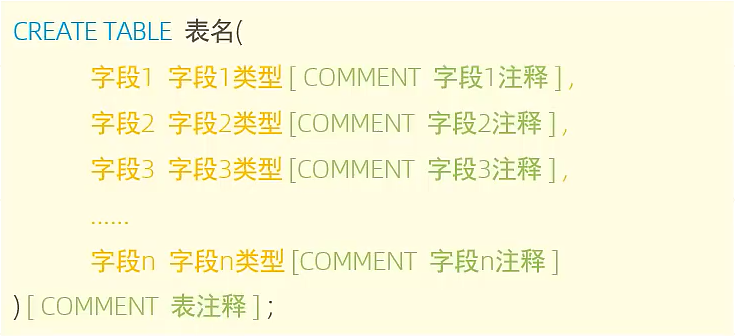
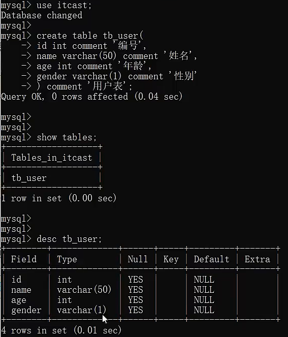
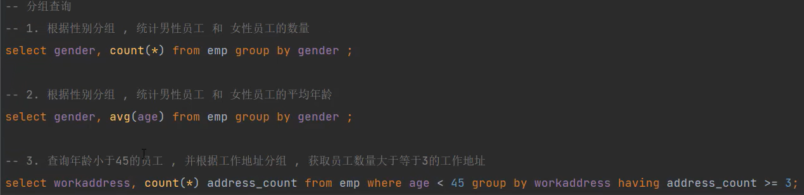
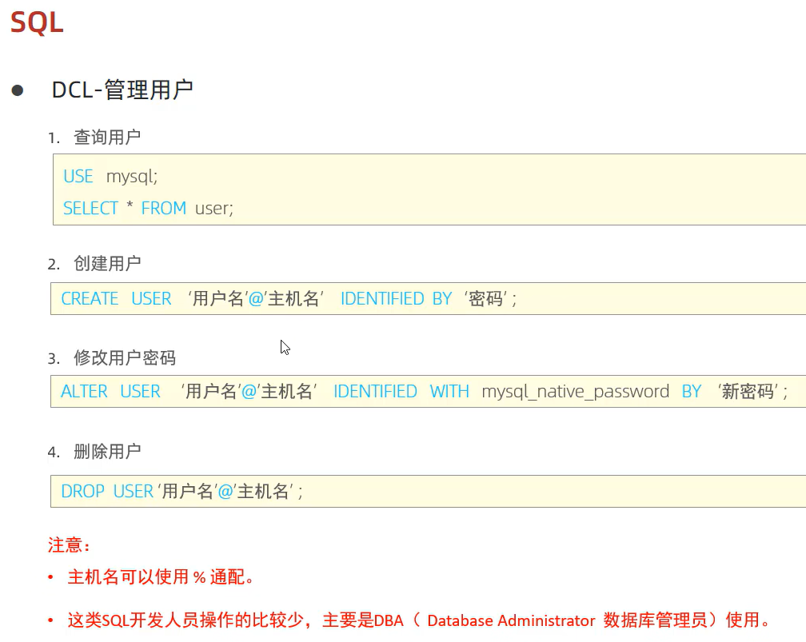

# DDL:数据定义语言

## 数据库操作

**方括号内为可选操作**

### 查询

* 查询所有数据库

  > show databases;

* 查询当前数据库

  > select database();

### 创建

> create database [if not exists] 数据库名 [default charset 字符集] [collate 排序规则];

### 删除

> drop database [if exists] 数据库名;

### 使用

> use 数据库名;

## 表操作

### 查询

* 查询当前数据库所有表

  > show tables;

* 查询表结构

  > desc 表名;

* 查询指定表的建表语句

  > show create table 表名;

### 创建

==注意：[...]为可选参数，最后一个字段后面没有逗号==

1、执行顺序是where > 聚合函数 > having

2、先用where把数据过滤了，再用count(*)把过滤出来的所有数据进行统计（实际上用count(address)更好，直接省去前面的address）

3、count统计出来结果之后再通过having对这个结果进行二次过滤

## 用户管理 开发人员不用重点掌握

==在实体类中，基本数据类型建议使用其对应的包装类型。因为基本类型有默认值，可能有业务含义，而包装类默认值是null==